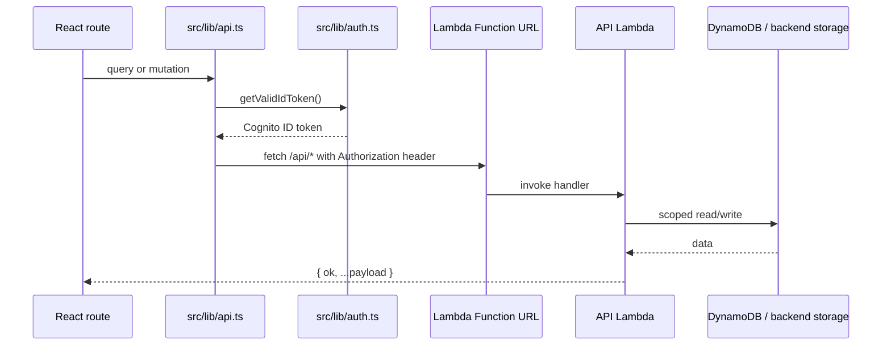
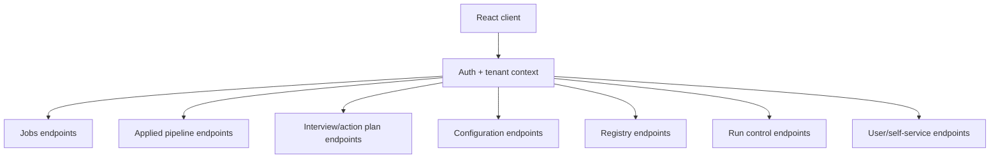
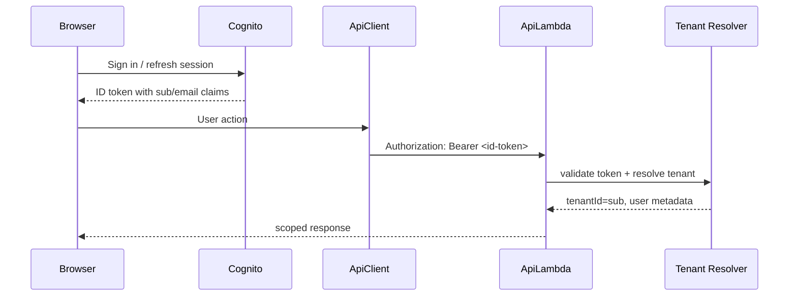
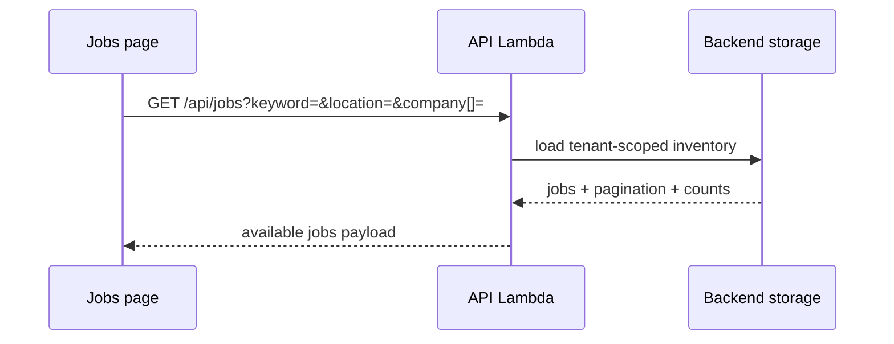
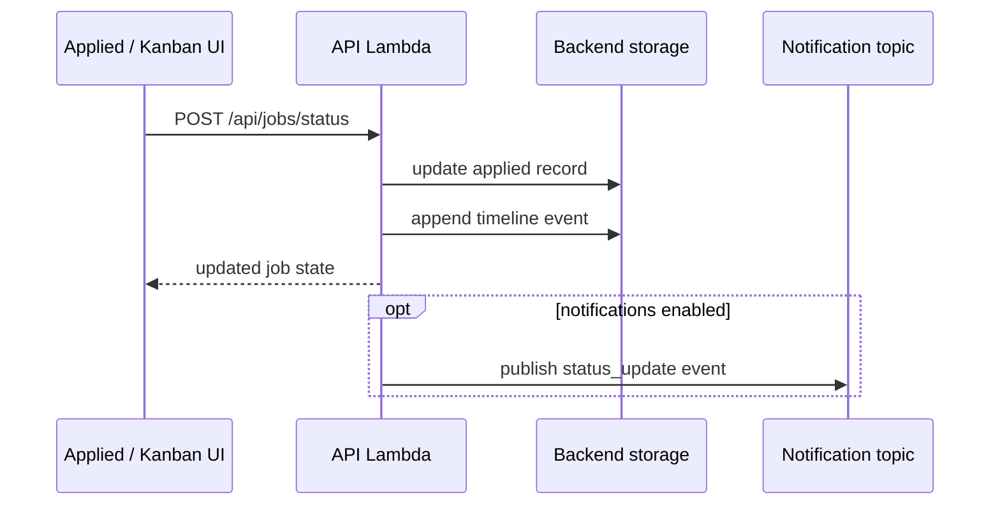
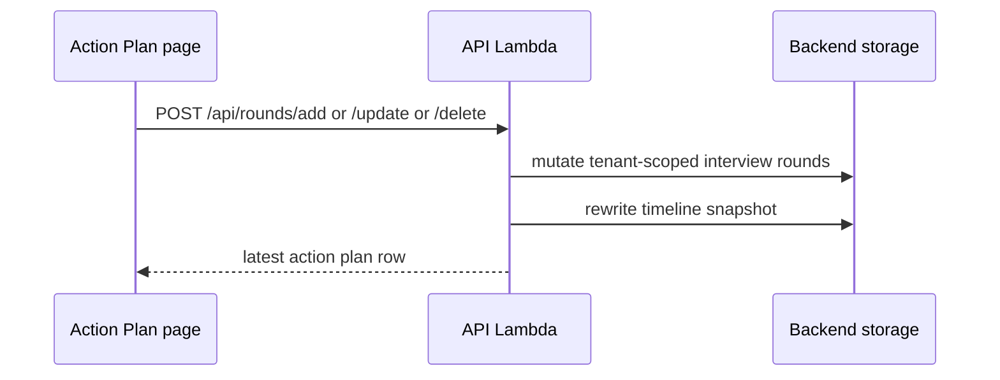
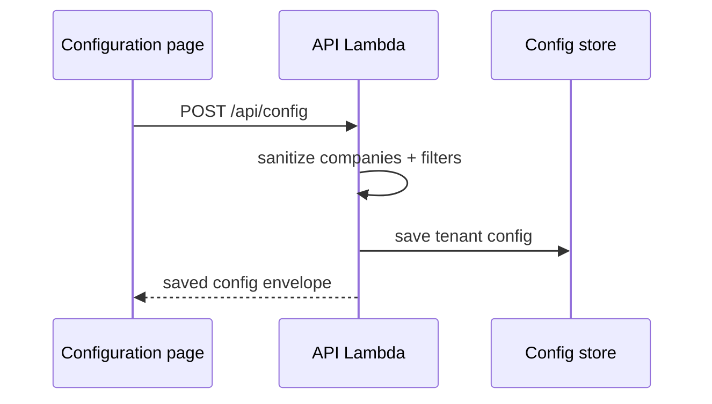
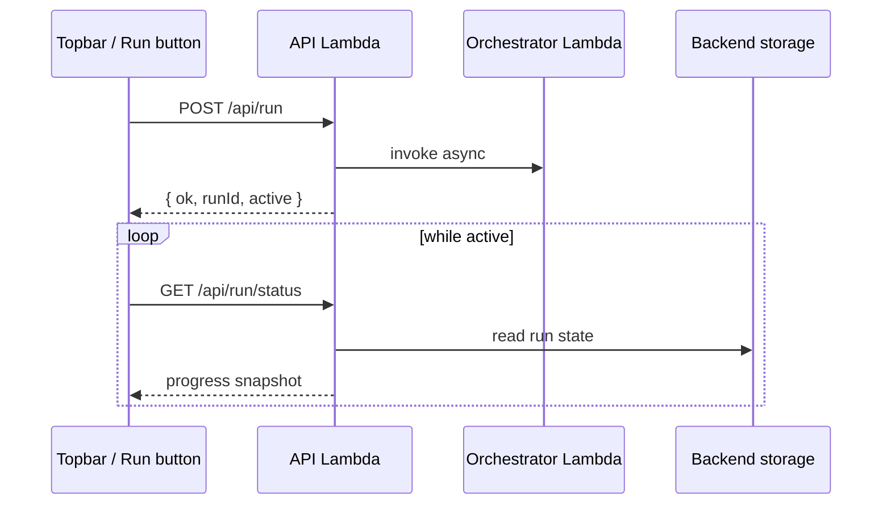
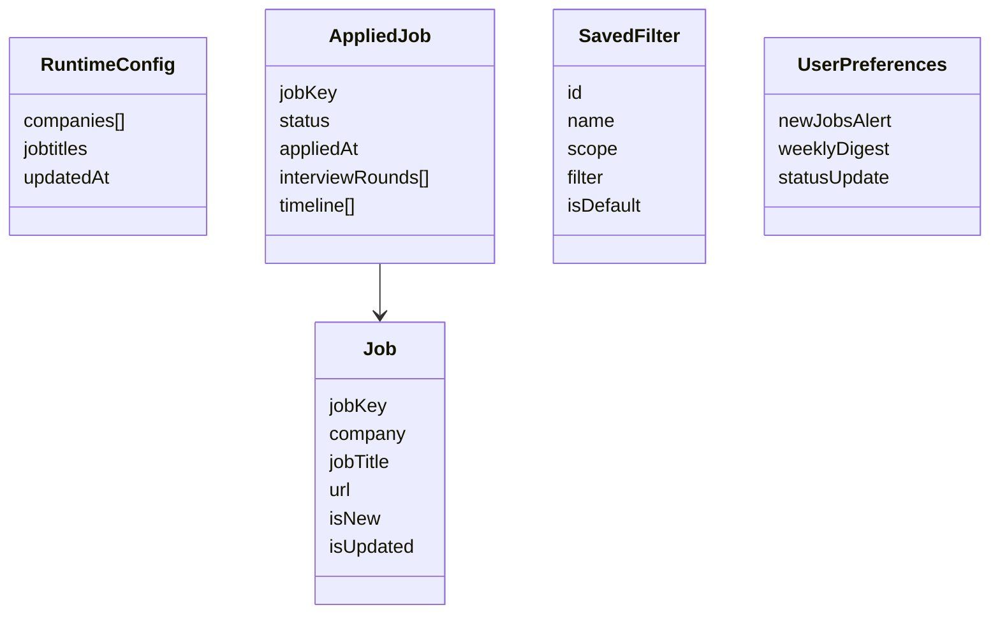

# API Flows

All endpoints are on the API Lambda Function URL. Auth: `Authorization: Bearer <cognito-id-token>` on every request. In mock mode (`?demo=1`), all calls are intercepted client-side.

---

## End-to-End Request Path

## API Surface Map

## Authentication and Authorization Flow

## Available Jobs

| Method | Path | Description |
|--------|------|-------------|
| GET | `/api/jobs` | List available jobs. Query params: `keyword`, `location`, `company[]`, `newOnly`, `updatedOnly`, `limit`, `offset` |
| POST | `/api/jobs/apply` | Move job to applied pipeline. Body: `{ jobKey, notes? }` |
| POST | `/api/jobs/discard` | Remove job from available list. Body: `{ jobKey }` |
| POST | `/api/jobs/notes` | Save legacy single-string notes. Body: `{ jobKey, notes }` |
| POST | `/api/notes/add` | Add a note record. Body: `{ jobKey, text }` → returns `{ ok, record }` |
| POST | `/api/notes/update` | Edit a note record. Body: `{ jobKey, noteId, text }` |
| POST | `/api/notes/delete` | Delete a note record. Body: `{ jobKey, noteId }` |
| POST | `/api/jobs/manual-add` | Manually add a job. Body: `{ company, jobTitle, url?, location?, notes? }` |

### Available Jobs Sequence

## Applied Jobs & Pipeline

| Method | Path | Description |
|--------|------|-------------|
| GET | `/api/applied-jobs` | List all applied jobs with status, rounds, timeline |
| POST | `/api/jobs/status` | Update pipeline status. Body: `{ jobKey, status }` — one of Applied/Interview/Negotiations/Offered/Rejected |

### Status Change Sequence

## Interview Rounds (Action Plan)

| Method | Path | Description |
|--------|------|-------------|
| GET | `/api/action-plan` | List jobs on action plan with interview rounds |
| POST | `/api/rounds/add` | Add interview round. Body: `{ jobKey, number }` |
| POST | `/api/rounds/update` | Update round fields. Body: `{ jobKey, roundId, designation?, scheduledAt?, outcome?, notes? }` |
| POST | `/api/rounds/delete` | Delete a round. Body: `{ jobKey, roundId }` |

### Action Plan Sequence

## Dashboard

| Method | Path | Description |
|--------|------|-------------|
| GET | `/api/dashboard` | KPIs: pipeline counts, stage breakdown, last run time |

## Configuration

| Method | Path | Description |
|--------|------|-------------|
| GET | `/api/config` | Load runtime config: tracked companies, title filters |
| POST | `/api/config` | Save runtime config |
| POST | `/api/companies/toggle` | Pause/resume a company's scan. Body: `{ company, paused }` |
| POST | `/api/companies/toggle-all` | Pause/resume all scans |

### Configuration Save Flow

## Registry (Company Discovery)

| Method | Path | Description |
|--------|------|-------------|
| GET | `/api/registry/meta` | Registry metadata: total companies, ATS breakdown |
| GET | `/api/registry/companies` | Search registry. Query: `q`, `ats`, `tier`, `limit` |
| GET | `/api/registry/companies/:key` | Get single company entry |

## Scan Run

| Method | Path | Description |
|--------|------|-------------|
| POST | `/api/run` | Trigger a fresh scan (async, returns immediately) |
| GET | `/api/run/status` | Poll run status: active, fetched, total, percent |
| POST | `/api/jobs/remove-broken-links` | Clean up stale job URLs |

### Run Trigger and Polling Flow

## Cache & State Management

| Method | Path | Description |
|--------|------|-------------|
| POST | `/api/jobs/clear` | Clear available jobs + ATS cache |
| POST | `/api/cache/clear-ats` | Clear ATS cache only |

---

## Response Envelope

All responses return `{ ok: boolean, ...data }`. Errors return `{ ok: false, error: string }` with an appropriate HTTP status code.

## Resource Model

---

## Frontend ↔ Backend Contract

The React app (`career-jump-web`) is built against this API contract. The mock interceptor in `src/mocks/install.ts` implements the same contract using in-memory state, allowing full UI development without a running backend.

To connect to the real backend, set `VITE_API_BASE_URL` at build time — the `api` client in `src/lib/api.ts` prepends this to all requests.
