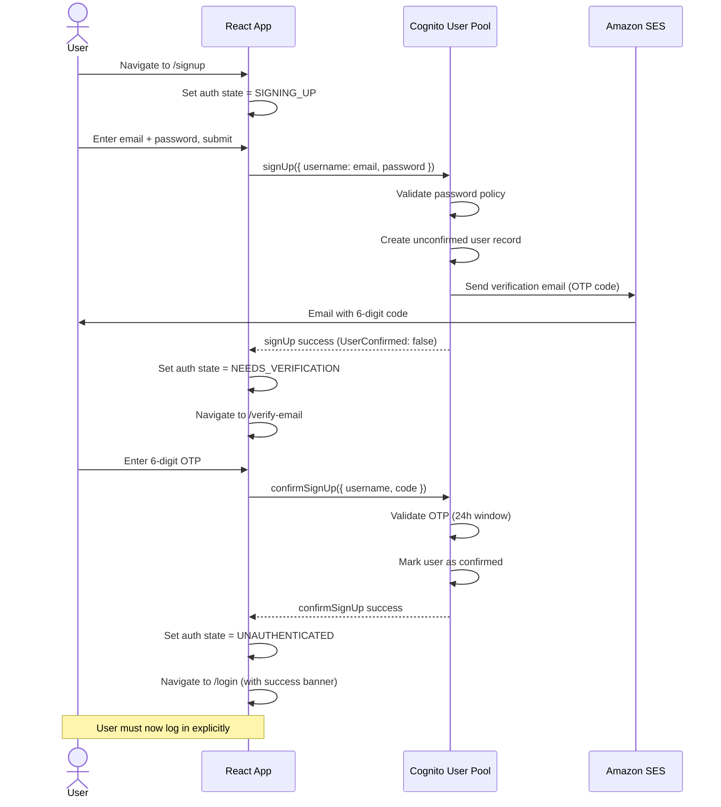
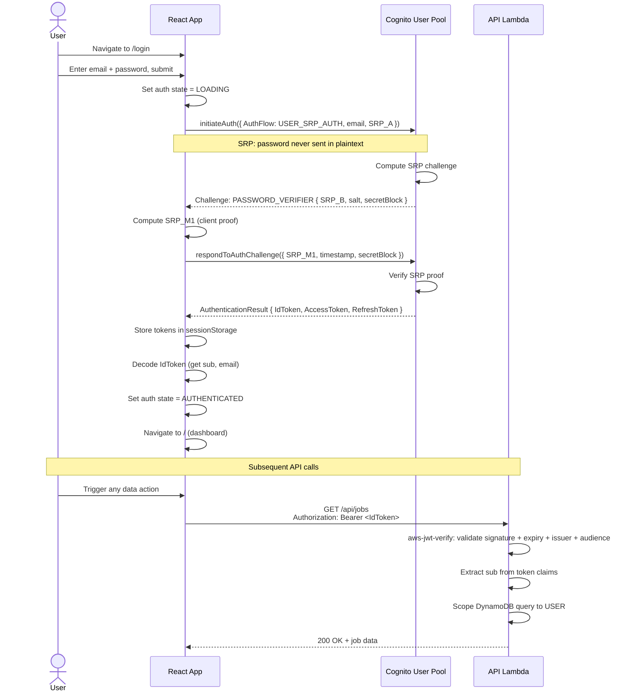
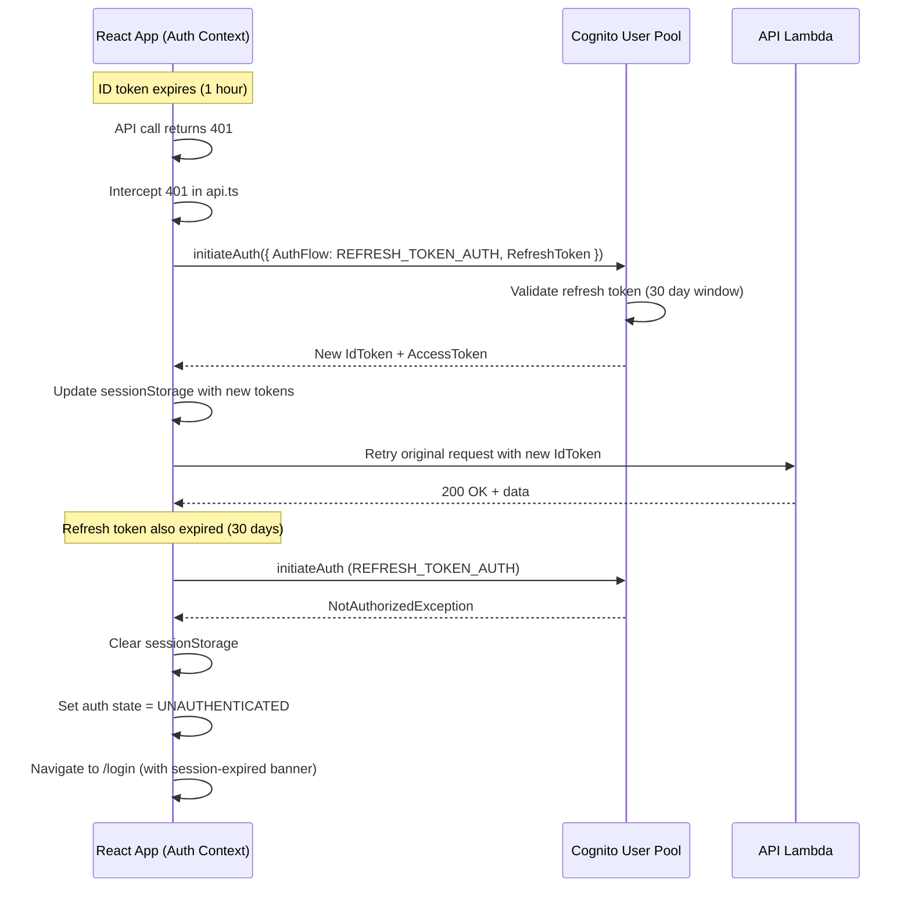
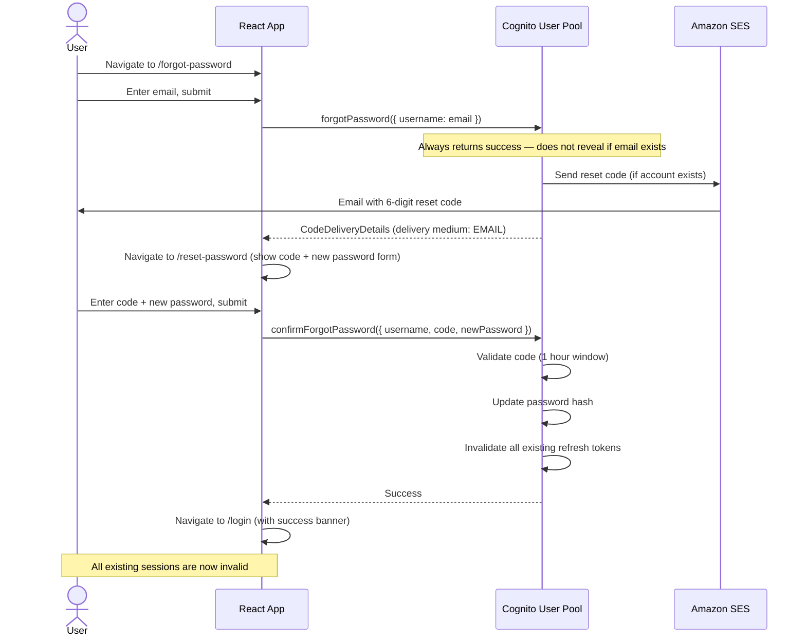

# Authentication & Authorization

Career Jump uses Amazon Cognito User Pools as the sole identity provider. This document covers the full auth lifecycle: signup, email verification, login, token refresh, password reset, route protection, and API authorization. All auth state is managed client-side via a React context backed by the Cognito JavaScript SDK.

---

## Table of Contents

1. [Auth State Machine](#auth-state-machine)
2. [Cognito User Pool Configuration](#cognito-user-pool-configuration)
3. [Token Types](#token-types)
4. [Token Storage Strategy](#token-storage-strategy)
5. [Signup Flow](#signup-flow)
6. [Login Flow](#login-flow)
7. [Token Refresh Flow](#token-refresh-flow)
8. [Forgot Password Flow](#forgot-password-flow)
9. [Route Protection](#route-protection)
10. [API Authorization](#api-authorization)
11. [Security Considerations](#security-considerations)

---

## Auth State Machine

The client maintains one of five mutually exclusive auth states at all times. State transitions are driven by Cognito SDK responses and user actions.

```
LOADING
  │
  ├─► UNAUTHENTICATED  ──────────────────────────────────────────────────┐
  │         │                                                             │
  │    [user clicks Sign Up]                                             │
  │         ▼                                                             │
  │   SIGNING_UP                                                          │
  │         │                                                             │
  │    [signup API call succeeds → Cognito sends verification email]      │
  │         ▼                                                             │
  │   NEEDS_VERIFICATION  ──[wrong code / resend]──► NEEDS_VERIFICATION  │
  │         │                                                             │
  │    [correct OTP entered]                                              │
  │         ▼                                                             │
  └──► AUTHENTICATED ◄──────────────────────────────────────────────────┘
              │
         [logout / token invalid / account deleted]
              ▼
       UNAUTHENTICATED
```

| State | Description | Allowed Routes |
|-------|-------------|----------------|
| `LOADING` | Session restore in progress (checking sessionStorage for tokens) | None — spinner shown |
| `UNAUTHENTICATED` | No valid session | `/login`, `/signup`, `/forgot-password`, `/privacy` |
| `SIGNING_UP` | Cognito `signUp()` called, awaiting user to submit OTP | `/verify-email` |
| `NEEDS_VERIFICATION` | Email sent; user must enter 6-digit code | `/verify-email` |
| `AUTHENTICATED` | Valid ID + Access token in sessionStorage | All app routes |

---

## Cognito User Pool Configuration

The Cognito User Pool is defined in `career-jump-aws/template.yaml` under the `UserPool` resource. Key settings:

| Parameter | Value | Rationale |
|-----------|-------|-----------|
| **Sign-in alias** | `email` | Users identify by email; no username friction |
| **Password policy** | Min 8 chars, uppercase, lowercase, digit | SOC2 CC6.1 minimum |
| **MFA** | Optional (TOTP) | Required for SOC2 upgrade path |
| **Email verification** | Required on signup | Prevents fake accounts; CCPA contact accuracy |
| **Verification type** | CODE (6-digit OTP) | Simpler UX than link-based; expires in 24h |
| **Self-service signup** | Enabled | Users register without admin action |
| **Account recovery** | Email only | No SMS cost; email is the verified channel |
| **Token validity — ID** | 1 hour | Minimize window of stolen token misuse |
| **Token validity — Access** | 1 hour | Same as ID token |
| **Token validity — Refresh** | 30 days | Session persistence without repeated login |
| **App client** | Public (no secret) | Required for SPA — client secret cannot be hidden in browser |
| **Auth flows** | `USER_SRP_AUTH`, `REFRESH_TOKEN_AUTH` | SRP: no password on the wire; refresh: silent renewal |
| **Hosted UI** | Disabled | Custom auth UI used (ADR-005) |

### Attribute Schema

| Attribute | Type | Mutable | Notes |
|-----------|------|---------|-------|
| `email` | String | Yes | Primary identifier; must be verified |
| `email_verified` | Boolean | No (Cognito-managed) | Set true after OTP confirmation |
| `sub` | UUID | No | Immutable tenant ID — never changes, even if email changes |

---

## Token Types

Cognito issues three JWTs on successful authentication. Understanding each is critical for correct API usage and security posture.

### ID Token

- **Issuer**: `https://cognito-idp.us-east-1.amazonaws.com/<UserPoolId>`
- **Purpose**: Identity assertion — who the user is
- **Claims**: `sub`, `email`, `email_verified`, `cognito:username`, `iat`, `exp`, `aud`
- **Used for**: API `Authorization: Bearer` header (Lambda validates this token)
- **Validity**: 1 hour
- **Key claim `sub`**: The tenant ID. Immutable UUID assigned at account creation. Used as DynamoDB partition key prefix.

### Access Token

- **Purpose**: Authorization — what the user can do (Cognito resource server scopes)
- **Claims**: `sub`, `scope`, `client_id`, `token_use: access`
- **Used for**: Cognito API calls (e.g., `getUser`, `changePassword`) — not sent to our API
- **Validity**: 1 hour

### Refresh Token

- **Purpose**: Obtain new ID + Access tokens without re-login
- **Storage**: sessionStorage (same as ID/Access tokens)
- **Validity**: 30 days (rolling)
- **Revocation**: Cognito `revokeToken` call on logout; also auto-invalidated on password change

```
┌─────────────────────────────────────────────────────┐
│  Token Usage Summary                                │
│                                                     │
│  API Lambda ◄── ID Token (Authorization: Bearer)   │
│  Cognito SDK ◄── Access Token (SDK internal calls) │
│  Token renewal ◄── Refresh Token (silent flow)     │
└─────────────────────────────────────────────────────┘
```

---

## Token Storage Strategy

**Primary store: `sessionStorage`**

Tokens are stored in `sessionStorage` under the keys the Cognito Amplify SDK manages automatically:

```
sessionStorage keys (set by Cognito SDK):
  CognitoIdentityServiceProvider.<clientId>.<username>.idToken
  CognitoIdentityServiceProvider.<clientId>.<username>.accessToken
  CognitoIdentityServiceProvider.<clientId>.<username>.refreshToken
  CognitoIdentityServiceProvider.<clientId>.LastAuthUser
```

### Why sessionStorage, not localStorage?

| Property | sessionStorage | localStorage |
|----------|---------------|--------------|
| Persists across tabs | No | Yes |
| Persists after browser close | No | Yes |
| XSS token theft risk | Same-tab only | All tabs + extensions |
| CCPA/SOC2 posture | Better | Acceptable |
| User experience | Must re-login on new tab | Stays logged in |

For Career Jump's single-user, low-risk profile, sessionStorage provides the right balance: tokens are cleared when the browser/tab closes, limiting exposure without requiring complex httpOnly cookie infrastructure.

### No HttpOnly Cookies (Current)

HttpOnly cookies would eliminate XSS token theft entirely but require:
- A server-side session endpoint to set the cookie
- CSRF protection (SameSite + CSRF token)
- Lambda changes to read cookies instead of Authorization header

This is the recommended upgrade path for SOC2 Type II. Tracked as a gap in `docs/compliance/soc2.md`.

---

## Signup Flow



**Error states during signup:**

| Error Code | Cause | UI Action |
|-----------|-------|-----------|
| `UsernameExistsException` | Email already registered | Show "Already have an account? Log in" |
| `InvalidPasswordException` | Password policy violation | Show inline field error |
| `CodeMismatchException` | Wrong OTP | Show error, offer resend |
| `ExpiredCodeException` | OTP older than 24h | Auto-trigger resend |
| `LimitExceededException` | Too many OTP attempts | Show cooldown message |

---

## Login Flow



**SRP (Secure Remote Password) protocol** means the user's password is never transmitted — only a cryptographic proof that the client knows the password. This protects against:
- Man-in-the-middle token interception
- Password exposure in transit
- Server-side password storage vulnerabilities

**Error states during login:**

| Error Code | Cause | UI Action |
|-----------|-------|-----------|
| `NotAuthorizedException` | Wrong password | Show generic "Invalid credentials" |
| `UserNotConfirmedException` | Email not verified | Redirect to /verify-email, trigger resend |
| `UserNotFoundException` | No account with that email | Show generic "Invalid credentials" (do not confirm existence) |
| `PasswordResetRequiredException` | Admin forced reset | Redirect to /forgot-password |
| `TooManyRequestsException` | Brute-force lockout | Show cooldown with retry timer |

---

## Token Refresh Flow



**Refresh strategy**: The API client (`src/lib/api.ts`) wraps all fetch calls. On a 401 response, it attempts one refresh before giving up. This is transparent to all call sites — components never handle token refresh logic directly.

```typescript
// src/lib/api.ts — conceptual refresh interceptor
async function fetchWithAuth(url: string, options: RequestInit) {
  const token = getStoredIdToken();
  const response = await fetch(url, {
    ...options,
    headers: { ...options.headers, Authorization: `Bearer ${token}` },
  });

  if (response.status === 401) {
    const refreshed = await refreshTokens(); // calls Cognito REFRESH_TOKEN_AUTH
    if (!refreshed) {
      signOut(); // clears session, redirects to /login
      throw new AuthError('Session expired');
    }
    return fetch(url, {
      ...options,
      headers: { ...options.headers, Authorization: `Bearer ${getStoredIdToken()}` },
    });
  }

  return response;
}
```

---

## Forgot Password Flow



Security notes:
- `forgotPassword()` always returns success regardless of whether the email exists — prevents account enumeration
- All refresh tokens are invalidated on password change — forces re-login on all devices
- Reset code expires in 1 hour

---

## Route Protection

All routes inside the authenticated shell are protected by a `RequireAuth` wrapper component. TanStack Router's `beforeLoad` hook performs the check synchronously — no authenticated content is rendered before the check completes.

```
/                  → RequireAuth → Dashboard
/jobs              → RequireAuth → Jobs List
/applied           → RequireAuth → Applied Kanban
/plan              → RequireAuth → Action Plan
/configuration     → RequireAuth → Settings

/login             → RedirectIfAuth → Login Page
/signup            → RedirectIfAuth → Signup Page
/verify-email      → (open — needs email param from signup flow)
/forgot-password   → (open)
/reset-password    → (open — needs code param)
/privacy           → (open — CCPA privacy policy)
```

`RequireAuth` behavior:
1. If `authState === LOADING` → render global spinner
2. If `authState === AUTHENTICATED` → render children
3. Otherwise → `router.navigate({ to: '/login', search: { redirect: currentPath } })`

After successful login, the `redirect` search param is used to return the user to their intended destination.

---

## API Authorization

Every request from the React app to the API Lambda includes the Cognito ID token as a Bearer token. The Lambda validates the token and extracts the `sub` claim for data scoping.

### Lambda Token Validation

```typescript
// career-jump-aws/src/auth.ts
import { CognitoJwtVerifier } from 'aws-jwt-verify';

const verifier = CognitoJwtVerifier.create({
  userPoolId: process.env.COGNITO_USER_POOL_ID!,
  tokenUse: 'id',
  clientId: process.env.COGNITO_CLIENT_ID!,
});

export async function validateToken(authHeader: string): Promise<{ sub: string; email: string }> {
  const token = authHeader.replace('Bearer ', '');
  const payload = await verifier.verify(token);
  return { sub: payload.sub, email: payload.email as string };
}
```

The verifier checks:
- JWT signature (against Cognito's JWKS endpoint, cached)
- `exp` claim (token not expired)
- `iss` claim (correct User Pool issuer)
- `aud` claim (correct App Client ID)
- `token_use: id` (ID token, not access token)

### Data Scoping

After validation, `sub` is used as the tenant prefix for all DynamoDB operations:

```typescript
const { sub } = await validateToken(event.headers.Authorization);
// All queries are automatically scoped:
const pk = `USER#${sub}#JOBS`;
```

No data can cross tenant boundaries — the Lambda never accepts a userId parameter from the request body; it always derives the user identity from the validated JWT. See `docs/architecture/multi-tenancy.md` for the full data isolation model.

---

## Security Considerations

### Token Expiry

| Token | Expiry | Action on Expiry |
|-------|--------|-----------------|
| ID Token | 1 hour | Auto-refresh via Refresh Token |
| Access Token | 1 hour | Refreshed alongside ID Token |
| Refresh Token | 30 days | Force re-login; show session-expired banner |

### PKCE Readiness

The Cognito App Client is configured with `AllowedOAuthFlows: code` and PKCE support enabled. Currently the app uses `USER_SRP_AUTH` (direct SDK flow without a browser redirect), but the infrastructure is ready to switch to the PKCE authorization code flow if a Hosted UI or third-party OAuth provider is added in the future. This is noted in ADR-005.

### No Client Secret in SPA

The Cognito App Client has `GenerateSecret: false`. SPA JavaScript is public — any client secret embedded in the bundle would be immediately extractable. Cognito's public client model (with SRP auth) is the correct pattern for browser applications.

### Content Security Policy

The CloudFront distribution (via Response Headers Policy) sets:

```
Content-Security-Policy:
  default-src 'self';
  script-src 'self';
  connect-src 'self' https://cognito-idp.us-east-1.amazonaws.com https://<lambda-function-url>;
  style-src 'self' 'unsafe-inline';
  img-src 'self' data:;
  frame-ancestors 'none';
```

This limits XSS blast radius — even if an attacker injects a script, it cannot exfiltrate tokens to an external domain.

### Logout

On logout, the app:
1. Calls `cognitoClient.revokeToken(refreshToken)` — server-side refresh token invalidation
2. Calls `cognitoClient.signOut()` — SDK local state cleanup
3. Calls `sessionStorage.clear()` — removes all tokens from browser storage
4. Navigates to `/login`

Refresh token revocation is critical — it prevents a stolen refresh token from being used after logout.

### Rate Limiting / Brute Force

Cognito User Pools have built-in adaptive authentication that detects brute-force patterns and automatically blocks repeated failed login attempts. No additional rate-limiting infrastructure is needed at the application layer for MVP.

### Audit Trail

All Cognito auth events (login, signup, password reset, token refresh) are automatically captured in CloudTrail and can be queried in CloudWatch Logs Insights. This satisfies SOC2 CC7.2 monitoring requirements.
