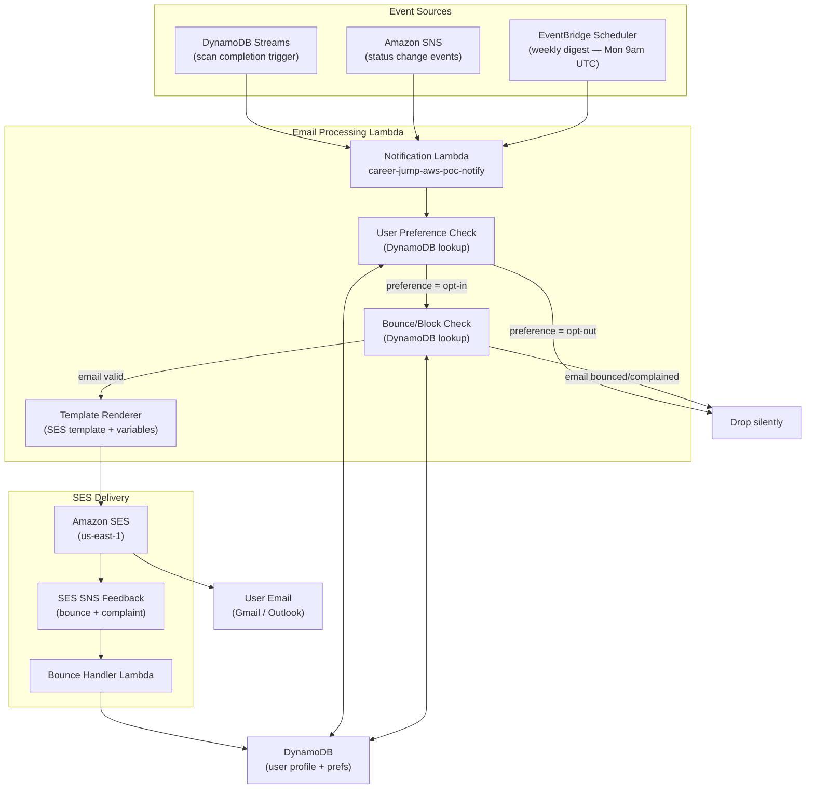
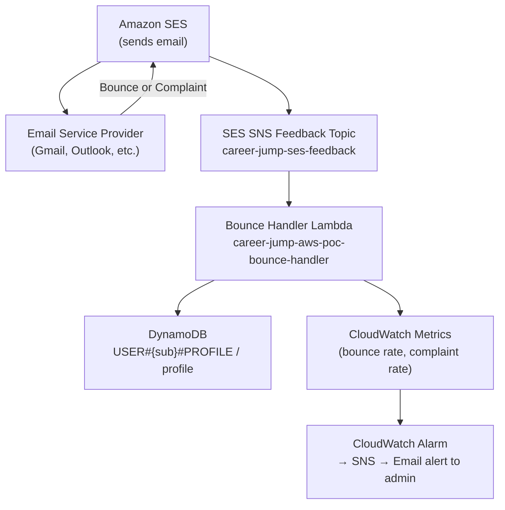

# Email Notification System

Career Jump sends transactional and automated emails via Amazon SES. Emails are triggered by three event sources: DynamoDB Streams (scan completion), SNS (application status changes), and EventBridge Scheduler (weekly digest). User preferences control opt-in/opt-out per notification type. This document covers the full email architecture, template inventory, delivery pipeline, and operational concerns including bounce handling and SES quota management.

---

## Table of Contents

1. [Architecture Overview](#architecture-overview)
2. [Event Sources](#event-sources)
3. [Email Types](#email-types)
4. [SES Configuration](#ses-configuration)
5. [User Preferences](#user-preferences)
6. [Bounce and Complaint Handling](#bounce-and-complaint-handling)
7. [Template Management](#template-management)
8. [SES Sending Limits and Warm-Up](#ses-sending-limits-and-warm-up)
9. [Monitoring and Alerting](#monitoring-and-alerting)
10. [Migration from Google Apps Script](#migration-from-google-apps-script)
11. [Local Development and Testing](#local-development-and-testing)

---

## Architecture Overview



---

## Event Sources

### 1. DynamoDB Streams (Scan Completion)

When the Finalize Run Lambda completes a scan, it writes a run summary record to DynamoDB. The Streams trigger fires on this write and invokes the Notification Lambda.

```
Finalize Lambda
  → PutItem: USER#{sub}#RUN / state { status: 'complete', newJobsCount: N, runId }
    → DynamoDB Stream (NEW_AND_OLD_IMAGES)
      → Notification Lambda (if status == 'complete' AND newJobsCount > 0)
        → Send "New Jobs Alert" email
```

**Stream configuration:**
- `StreamSpecification.StreamViewType: NEW_AND_OLD_IMAGES`
- Lambda event source mapping: batch size 1, starting position `LATEST`
- Filter: `{ eventName: ["INSERT", "MODIFY"], dynamodb.newImage.status.S: ["complete"] }`

### 2. Amazon SNS (Status Change Events)

When a user moves a job in the Kanban (Applied → Interview → Offer), the API Lambda publishes an SNS message:

```
API Lambda (PATCH /api/applied/{jobId})
  → SNS Publish: topic=career-jump-status-changes
    { sub, jobId, previousStatus, newStatus, jobTitle, company }
      → Notification Lambda subscription
        → Send "Application Status Update" email
```

**SNS topic**: `career-jump-aws-poc-status-changes`
**Subscription protocol**: Lambda (direct invocation)

### 3. EventBridge Scheduler (Weekly Digest)

```
EventBridge Scheduler
  Rule: cron(0 9 ? * MON *)  — 9:00am UTC every Monday
    → Notification Lambda
      { type: 'WEEKLY_DIGEST' }
        → Query all users with digest opt-in
          → For each user: aggregate last 7 days of scan results
            → Send "Weekly Digest" email
```

The weekly digest Lambda scans the DynamoDB table for all `USER#*#PROFILE` records with `notificationPrefs.weeklyDigest: true` and processes them in batches. SES rate limiting is handled via an SQS queue when user count exceeds 50.

---

## Email Types

### 1. Welcome Email

| Property | Value |
|----------|-------|
| **Trigger** | First login — Lambda detects new user profile creation |
| **Template name** | `career-jump-welcome-v1` |
| **From address** | `notifications@career-jump.app` |
| **Subject** | `Welcome to Career Jump — your job search, automated` |
| **Opt-out category** | `transactional` (cannot opt out) |

**Key template variables:**
```json
{
  "userName": "Dipak",
  "userEmail": "dipak@example.com",
  "appUrl": "https://app.career-jump.app",
  "settingsUrl": "https://app.career-jump.app/configuration",
  "supportEmail": "support@career-jump.app"
}
```

**Content outline:**
- What Career Jump does (one sentence)
- Link to configure first companies and title filters
- Link to run first scan
- Unsubscribe/preferences link

---

### 2. Email Verification

| Property | Value |
|----------|-------|
| **Trigger** | User signup via Cognito |
| **Template** | Cognito built-in (customizable via `EmailVerificationMessage` in User Pool config) |
| **Sender** | Cognito default or SES via Cognito `FROM` address configuration |
| **Opt-out** | Not applicable — required for account creation |

**Cognito template customization** (in `template.yaml`):
```yaml
EmailVerificationMessage: |
  Your Career Jump verification code is {####}.
  Enter this code to activate your account.
  This code expires in 24 hours.
EmailVerificationSubject: "Career Jump — verify your email address"
```

---

### 3. New Jobs Alert

| Property | Value |
|----------|-------|
| **Trigger** | DynamoDB Stream — scan completion with `newJobsCount > 0` |
| **Template name** | `career-jump-new-jobs-v1` |
| **From address** | `notifications@career-jump.app` |
| **Subject** | `{newJobsCount} new jobs found at {companiesScanned} companies` |
| **Opt-out category** | `new_jobs_alert` (user can opt out in preferences) |
| **Frequency** | At most once per scan run (typically 3x/day on weekdays) |

**Key template variables:**
```json
{
  "userName": "Dipak",
  "newJobsCount": 5,
  "companiesScanned": 12,
  "runDate": "January 15, 2026",
  "topJobs": [
    { "title": "Staff Engineer", "company": "Anthropic", "location": "San Francisco, CA", "url": "..." },
    { "title": "Senior SWE", "company": "Stripe", "location": "Remote", "url": "..." }
  ],
  "viewAllUrl": "https://app.career-jump.app/jobs",
  "unsubscribeUrl": "https://app.career-jump.app/settings/notifications?token=..."
}
```

**Deduplication**: The Lambda checks if a notification was already sent for this `runId` before sending. A `notifiedAt` timestamp is stored in the run record.

---

### 4. Weekly Digest

| Property | Value |
|----------|-------|
| **Trigger** | EventBridge cron — every Monday at 9:00am UTC |
| **Template name** | `career-jump-weekly-digest-v1` |
| **From address** | `digest@career-jump.app` |
| **Subject** | `Your Career Jump week in review — {weekOf}` |
| **Opt-out category** | `weekly_digest` (default: opt-in for all users) |

**Key template variables:**
```json
{
  "userName": "Dipak",
  "weekOf": "January 13–19, 2026",
  "totalNewJobs": 23,
  "totalCompaniesScanned": 84,
  "totalScansRun": 15,
  "appliedThisWeek": 2,
  "activeApplications": 7,
  "upcomingInterviews": 1,
  "topNewJobs": [...],
  "viewDashboardUrl": "https://app.career-jump.app",
  "unsubscribeUrl": "..."
}
```

---

### 5. Application Status Update

| Property | Value |
|----------|-------|
| **Trigger** | SNS message on Kanban card drag (status change) |
| **Template name** | `career-jump-status-update-v1` |
| **From address** | `notifications@career-jump.app` |
| **Subject** | `Status update: {jobTitle} at {company} → {newStatus}` |
| **Opt-out category** | `status_updates` (default: opt-in) |

**Key template variables:**
```json
{
  "userName": "Dipak",
  "jobTitle": "Staff Engineer",
  "company": "Anthropic",
  "previousStatus": "Applied",
  "newStatus": "Phone Screen",
  "updatedAt": "January 15, 2026 at 2:30pm UTC",
  "jobUrl": "https://app.career-jump.app/applied/job-123",
  "notesUrl": "https://app.career-jump.app/applied/job-123/notes"
}
```

**Throttling**: Status updates are debounced — if a user moves a card multiple times within 10 minutes, only one email is sent with the final status.

---

### 6. Password Reset

| Property | Value |
|----------|-------|
| **Trigger** | User initiates "Forgot Password" flow via Cognito |
| **Template** | Cognito built-in (customizable) |
| **Opt-out** | Not applicable — security-critical transactional email |

**Cognito customization:**
```yaml
ForgotPasswordEmailVerificationMessage: |
  Your Career Jump password reset code is {####}.
  Enter this code to set a new password.
  This code expires in 1 hour. If you did not request a reset, ignore this email.
ForgotPasswordEmailVerificationSubject: "Career Jump — reset your password"
```

---

## SES Configuration

### Identity Verification

```
Domain identity: career-jump.app
  → DNS TXT record: DKIM keys (3 x 2048-bit RSA)
  → DNS MX record: SES inbound (optional)
  → DMARC: v=DMARC1; p=quarantine; rua=mailto:dmarc@career-jump.app

Sending addresses:
  notifications@career-jump.app  (job alerts, status updates, welcome)
  digest@career-jump.app         (weekly digest)
  data@career-jump.app           (CCPA requests, manual responses only)
```

### Configuration Set

A dedicated SES Configuration Set (`career-jump-notifications`) is attached to all sending calls. It enables:
- **Open tracking**: disabled (respects Do Not Track, CCPA)
- **Click tracking**: disabled
- **Bounce/complaint feedback**: enabled → SNS topic `career-jump-ses-feedback`
- **Rendering failures**: logged to CloudWatch
- **Sending statistics**: available in SES console and CloudWatch

### DKIM and SPF

| Record | Value |
|--------|-------|
| SPF | `v=spf1 include:amazonses.com ~all` |
| DKIM | 3 CNAME records from SES console (rotated automatically) |
| DMARC | `v=DMARC1; p=quarantine; adkim=r; aspf=r` |

Proper DKIM/DMARC configuration is required for production deliverability and is a prerequisite for SES production access.

---

## User Preferences

User notification preferences are stored in the `USER#{sub}#PROFILE / profile` DynamoDB record under the `notificationPrefs` map attribute:

```json
{
  "notificationPrefs": {
    "newJobsAlert": true,
    "weeklyDigest": true,
    "statusUpdates": true,
    "marketing": false
  },
  "emailValidated": true,
  "emailBounced": false,
  "bouncedAt": null
}
```

### Preference Management

Users manage preferences at `/configuration` → "Notification Settings". Changes are saved via `PATCH /api/user/profile` which updates the `notificationPrefs` map in DynamoDB.

### Unsubscribe Links

All marketing/digest emails include a signed unsubscribe URL:

```
https://app.career-jump.app/unsubscribe?token={JWT-signed-token}
```

The token encodes `{ sub, category, exp }` signed with the Lambda's secret key. Clicking the link calls `GET /api/unsubscribe?token=...` which:
1. Validates the token
2. Sets `notificationPrefs.{category}: false` in DynamoDB
3. Returns a confirmation page

One-click unsubscribe satisfies Google/Yahoo 2024 bulk sender requirements and CAN-SPAM Act compliance.

---

## Bounce and Complaint Handling



### Bounce Handling

**Hard bounce** (permanent delivery failure — invalid address, domain doesn't exist):
1. SES sends bounce notification to SNS feedback topic
2. Bounce Handler Lambda receives event
3. Sets `emailBounced: true`, `bouncedAt: {timestamp}` in user profile
4. All future email sends check `emailBounced` before calling SES API
5. User is shown a warning in-app: "We couldn't deliver emails to your address — update your email in Settings"

**Soft bounce** (temporary failure — mailbox full, server busy):
1. SES retries automatically per its retry policy
2. After 3 consecutive soft bounces, treated as hard bounce

### Complaint Handling

When a user marks an email as spam:
1. ISP sends complaint notification to SES
2. SES forwards to SNS feedback topic
3. Bounce Handler Lambda sets `notificationPrefs.marketing: false` and `notificationPrefs.weeklyDigest: false`
4. Transactional emails (welcome, verification, password reset) are not suppressed
5. User is added to SES account suppression list to prevent future sends

### SES Sending Reputation

AWS suspends SES sending if:
- **Bounce rate** exceeds 10% (warning) or 14% (suspension)
- **Complaint rate** exceeds 0.1% (warning) or 0.5% (suspension)

CloudWatch alarms are configured to alert the admin when bounce rate > 2% or complaint rate > 0.05%.

---

## Template Management

SES templates are defined in `career-jump-aws/src/email-templates/` and deployed via the AWS CLI or CloudFormation Custom Resource:

```
career-jump-aws/
  src/
    email-templates/
      welcome-v1.html          — HTML template
      welcome-v1.txt           — Plain text fallback
      new-jobs-v1.html
      new-jobs-v1.txt
      weekly-digest-v1.html
      weekly-digest-v1.txt
      status-update-v1.html
      status-update-v1.txt
    lambda/
      notification/
        index.ts               — Main notification Lambda
        send-welcome.ts
        send-new-jobs.ts
        send-weekly-digest.ts
        send-status-update.ts
        preferences.ts         — Preference lookup helper
        bounce-check.ts        — Bounce state lookup helper
```

Templates use Handlebars-compatible `{{variable}}` syntax. SES `SendTemplatedEmail` API handles variable substitution server-side.

**Versioning**: Templates are named with a version suffix (`-v1`, `-v2`). When updating a template, create a new versioned template rather than mutating the existing one. This allows A/B testing and safe rollback.

---

## SES Sending Limits and Warm-Up

### Sandbox Mode (Current State)

New AWS accounts start in SES sandbox:
- Can only send to verified email addresses
- Sending limit: 200 messages/day, 1 message/second
- Suitable for development and testing

**Verified test addresses for sandbox:**
```
dipak.bhujbal23@gmail.com  (primary user)
```

### Production Access Request

Before launch, request SES production access via AWS Support:
1. Describe use case: job tracking notifications for registered users
2. Expected volume: < 1,000 emails/month initially
3. Bounce/complaint handling: documented above
4. Unsubscribe mechanism: per-email one-click unsubscribe link

AWS typically approves within 24–48 hours. Production access raises limits to:
- 50,000 messages/day
- 14 messages/second (adjustable)

### Warm-Up Strategy

Even with production access, ISPs trust new sending domains more if volume ramps gradually. Recommended warm-up schedule:

| Week | Max Daily Volume | Notes |
|------|-----------------|-------|
| 1 | 50 | Send to engaged users only |
| 2 | 200 | Monitor bounce/complaint rates |
| 3 | 500 | Expand to all opted-in users |
| 4 | 1,000 | Normal operations |
| 5+ | Per growth | Scale with user base |

At Career Jump's current scale (single user, self-hosted), warm-up is not a concern. This becomes relevant when the platform opens to multiple users.

---

## Monitoring and Alerting

| Metric | Threshold | Action |
|--------|-----------|--------|
| SES bounce rate | > 2% | CloudWatch alarm → SNS → admin email |
| SES complaint rate | > 0.05% | CloudWatch alarm → SNS → admin email |
| Notification Lambda errors | > 0 | CloudWatch alarm → SNS → admin email |
| Email delivery latency | > 5 min | CloudWatch alarm (SES delivery delay) |
| DynamoDB Stream lag | > 1 min | CloudWatch alarm (stream processing delay) |

All SES sending metrics are visible in the SES console and in CloudWatch under the `AWS/SES` namespace.

---

## Migration from Google Apps Script

The previous notification system used Google Apps Script webhooks (called from the Finalize Lambda) to send emails via Gmail. The migration to SES involves:

**No data migration needed.** Email notifications are event-driven and stateless — there is no historical notification data to migrate. The switch involves:

1. Removing the Google Apps Script webhook call from the Finalize Lambda
2. Deploying the Notification Lambda with DynamoDB Streams trigger
3. Verifying the `career-jump.app` domain in SES
4. Creating SES email templates
5. Testing end-to-end with a sandbox scan run
6. Requesting SES production access
7. Deploying to production

**Backward compatibility**: During the transition, both systems can run in parallel by keeping the webhook call active while testing the SES path. Once SES emails are verified end-to-end, the webhook call is removed.

---

## Local Development and Testing

### Email Preview

SES does not have a local emulator. For local development, use one of:

1. **MailHog** — local SMTP server with web UI, captures all outgoing emails
   ```bash
   docker run -p 1025:1025 -p 8025:8025 mailhog/mailhog
   # Configure SES SMTP in Lambda env to point to localhost:1025
   ```

2. **AWS SES Sandbox** — send to verified addresses only; works with real SES

3. **Template preview** — render templates locally:
   ```bash
   cd career-jump-aws
   npx ts-node src/email-templates/preview.ts welcome-v1 '{"userName":"Test"}'
   # Opens browser with rendered HTML template
   ```

### Integration Tests

```bash
# Test notification Lambda locally with mocked SES
npm test -- --testPathPattern=notification

# Invoke Lambda with a mock DynamoDB Stream event
aws lambda invoke \
  --function-name career-jump-aws-poc-notify \
  --payload file://tests/fixtures/ddb-stream-scan-complete.json \
  response.json
```
