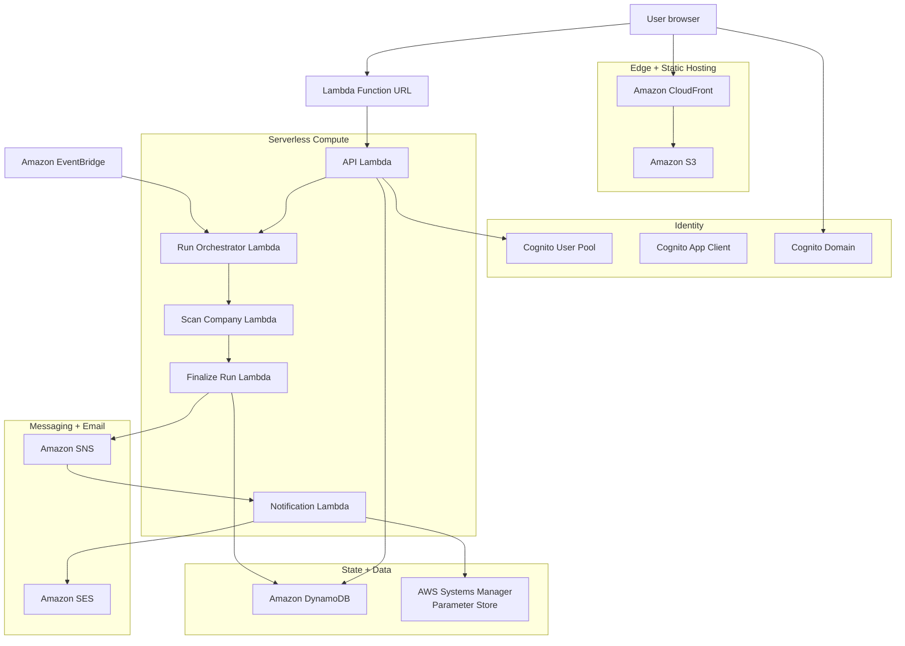
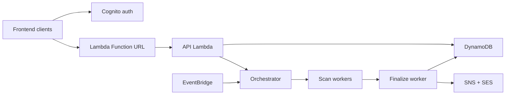
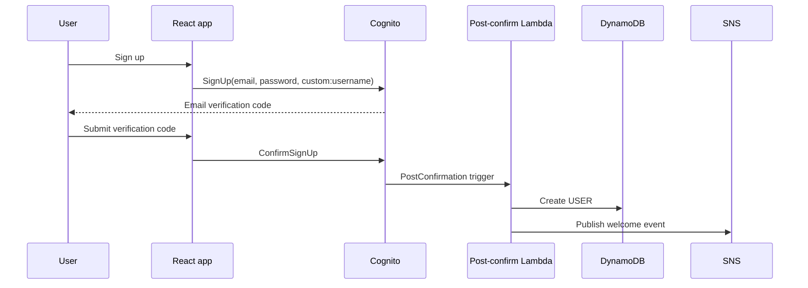
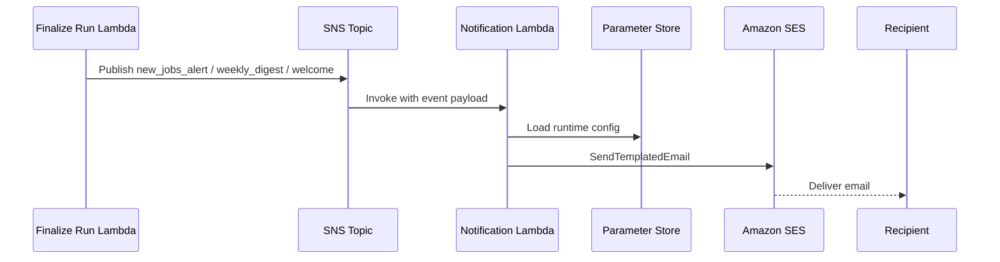
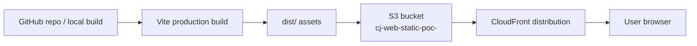

# Infrastructure Reference

## AWS Deployment Diagram

The diagram below is intended to read like an AWS component view while still
rendering natively on GitHub via Mermaid.



## Backend — React isolated stack (`career-jump-web-poc`)

All resources in `us-east-1`. v3.0.0 templates keep the React app in the
`career-jump-web` resource family so it can be operated separately from the
older `career-jump-aws` app.

### AWS Resources

| Resource | Name | Purpose |
|----------|------|---------|
| S3 | `FrontendBucket` | Hosts vanilla JS app assets |
| CloudFront | `FrontendDistribution` | HTTPS entrypoint for vanilla app; HTTP→HTTPS redirect |
| Cognito User Pool | `UserPool` | Single-user auth; admin-created-only |
| Cognito Client | `UserPoolClient` | OAuth2 PKCE browser flow |
| Cognito Domain | `UserPoolDomain` | Hosted login UI |
| Lambda | `career-jump-web-poc-api` | HTTP handler (30s, 512MB, 20 reserved concurrency) |
| Lambda | `career-jump-web-poc-run-orchestrator` | Fans out scans (60s, 256MB, 1 reserved) |
| Lambda | `career-jump-web-poc-scan-company` | Per-company ATS fetch (180s, 256MB, 40 reserved) |
| Lambda | `career-jump-web-poc-finalize-run` | Merges results, sends email (300s, 512MB, 1 reserved) |
| Lambda Function URL | `ApiFunctionUrl` | Direct HTTPS API endpoint (no API Gateway cost) |
| DynamoDB | `career-jump-web-poc-state` | Single-table, all state (PAY_PER_REQUEST) |
| EventBridge Scheduler | Weekday schedules | Scans every 3 hrs, Mon–Fri, 6am–9pm ET |
| CloudWatch Logs | 4 log groups | One per Lambda, 1-day retention |
| AWS Budgets | Monthly budget | Alerts at 60% + 100% of $5/month |

### Backend Stack UML Component Diagram



### Amazon Cognito Configuration

| Parameter | Value | Notes |
|-----------|-------|-------|
| User Pool name | `career-jump-aws-poc-users` | Defined in `template.yaml` |
| Sign-in alias | `email` | Users log in with email address |
| Self-service signup | Enabled | Users create their own accounts |
| Email verification | Required (OTP code, 24h expiry) | 6-digit code sent by Cognito/SES |
| Password policy | 8+ chars, upper, lower, digit | SOC2 CC6.1 minimum |
| MFA | Optional TOTP | Upgrade path for SOC2 Type II |
| App client type | Public (no client secret) | Required for SPA |
| Auth flows | `USER_SRP_AUTH`, `REFRESH_TOKEN_AUTH` | SRP: no password on wire |
| ID token validity | 1 hour | Short window limits stolen token exposure |
| Access token validity | 1 hour | Same as ID token |
| Refresh token validity | 30 days | Rolling; revoked on logout/password change |
| Hosted UI | Disabled | Custom UI per ADR-005 |
| Lambda triggers | Post-confirmation (tenant provision) | Creates USER#{sub}#PROFILE on first confirm |

**Cognito environment variables in API Lambda:**
```
COGNITO_USER_POOL_ID=us-east-1_XXXXXXXXX
COGNITO_CLIENT_ID=XXXXXXXXXXXXXXXXXXXXXXXXXX
```

### Cognito Provisioning Sequence



### Amazon SES Configuration

| Parameter | Value | Notes |
|-----------|-------|-------|
| Region | `us-east-1` | Same region as all other resources |
| Domain identity | `career-jump.app` | Verified via DNS TXT + DKIM records |
| Sending addresses | `notifications@career-jump.app`, `digest@career-jump.app` | Domain-verified |
| Configuration Set | `career-jump-notifications` | Attached to all `SendTemplatedEmail` calls |
| Open/click tracking | Disabled | CCPA + DNT compliance |
| Bounce/complaint feedback | Enabled → SNS `career-jump-ses-feedback` | Triggers Bounce Handler Lambda |
| Current mode | Sandbox | Upgrade to production before user launch |
| DKIM | 3 x 2048-bit RSA CNAME records | Auto-rotated by SES |
| SPF | `v=spf1 include:amazonses.com ~all` | DNS TXT record on `career-jump.app` |
| DMARC | `v=DMARC1; p=quarantine` | DNS TXT record on `_dmarc.career-jump.app` |

**SES environment variables in Notification Lambda:**
```
SES_FROM_ADDRESS=notifications@career-jump.app
SES_CONFIGURATION_SET=career-jump-notifications
SES_REGION=us-east-1
```

### Notification Delivery Sequence



### Additional Lambda Resources (Notifications)

| Resource | Name | Purpose |
|----------|------|---------|
| Lambda | `career-jump-aws-poc-notify` | Handles all email sends; triggered by DynamoDB Streams + SNS |
| Lambda | `career-jump-aws-poc-bounce-handler` | Processes SES bounce/complaint feedback from SNS |
| SNS Topic | `career-jump-aws-poc-status-changes` | Application status change events (Kanban moves) |
| SNS Topic | `career-jump-ses-feedback` | SES bounce/complaint notifications |

### Services Intentionally Excluded

API Gateway, Step Functions, NAT Gateway, RDS, ALB, EC2, Fargate, OpenSearch, ElastiCache.

### Lambda Build

All Lambdas: Node.js 22.x, arm64, esbuild (CJS, es2022, minified).

---

## React Frontend — `career-jump-web-poc` stack (new, isolated)

> **Live as an isolated deployment.** These resources stay separate from the
> older vanilla frontend stack.

### Naming Convention

All new resources use prefix `cj-web-*` to avoid collisions with the `career-jump-*` vanilla stack.

| Resource | Name |
|----------|------|
| S3 bucket | `cj-web-static-poc-<accountId>` |
| CloudFront | `cj-web-cdn-poc` |
| ACM cert | `cj-web-poc-cert` |
| Route53 record | `web.career-jump.app` (when domain added) |
| CFN stack | `career-jump-web-poc` |

### Tags on All New Resources

```
App=career-jump-web
Stack=react-rebuild
Environment=poc
Owner=dipak
```

### Deployment Flow (planned)

```
git push → GitHub Actions workflow
  → npm run build
    → dist/ uploaded to s3://cj-web-static-poc-<acct>/
      → CloudFront invalidation (/* paths)
```

### Frontend Hosting Diagram



### What Stays Shared

Both the vanilla app and the React app call the same API Lambda Function URL. No backend duplication. Same DynamoDB, same Cognito, same data.

---

## Local Development

```bash
cd ~/career-jump-web

# Dev server (mock mode auto-enabled at localhost)
npm run dev          # → http://localhost:5173

# Demo mode (explicit mock flag)
# Open http://localhost:5173/?demo=1

# Production build
npm run build        # → dist/

# Preview production build
npm run preview      # → http://localhost:4173
```

### Environment Variables

| Variable | Purpose | Default |
|----------|---------|---------|
| `VITE_API_BASE_URL` | Real backend URL, or runtime `window.CAREER_JUMP_AWS.apiBaseUrl` in production | Empty uses the dev proxy |
| `VITE_USE_MOCKS` | Enables mock mode on localhost only | `false` |

---

## Cost

Backend stays within AWS free tier / under $5/month. React hosting:
- S3: < $0.01/month (static files, single user)
- CloudFront: free tier (first 1TB/month, 10M requests)
- Total additional cost: ~$0
