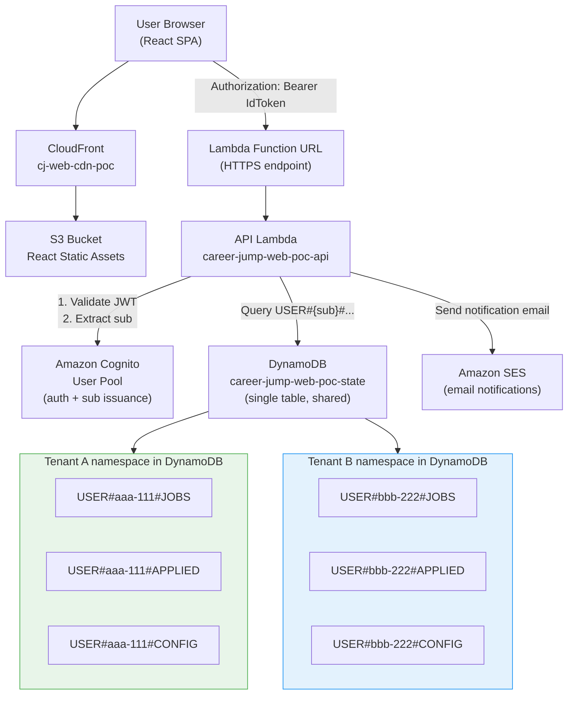
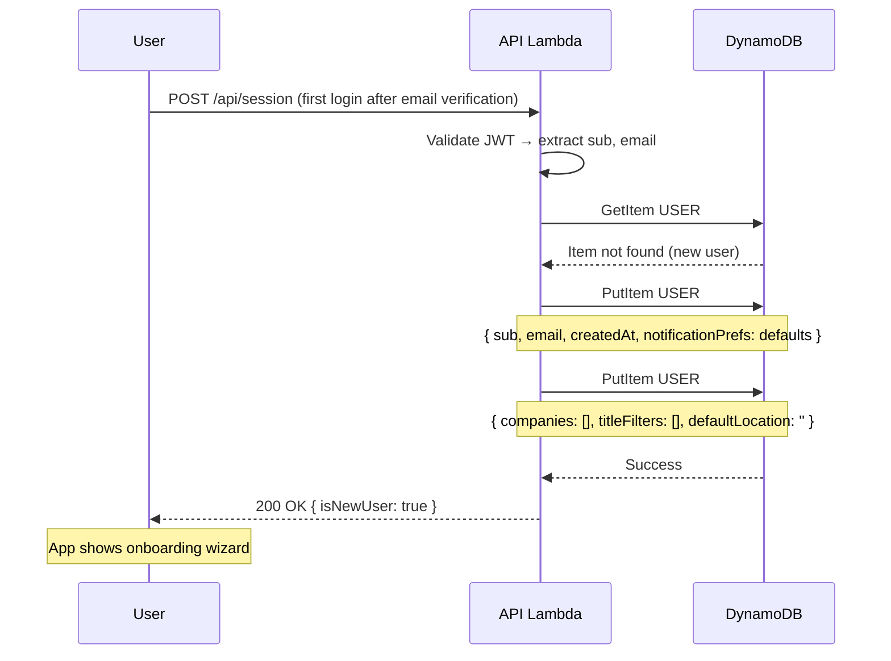
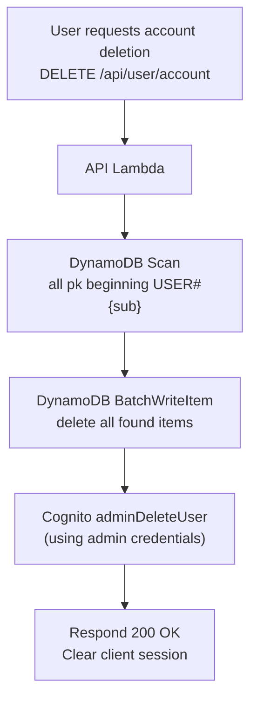

# Multi-Tenant Data Isolation

Career Jump is architected as a single-tenant-per-user SaaS. Every user's data is logically isolated within the shared DynamoDB table using a key prefix derived from their Cognito `sub` claim — a UUID that is immutable for the lifetime of the account.

This document defines the multi-tenancy model, DynamoDB key design, enforcement points, and operational considerations including tenant onboarding and data deletion.

---

## Table of Contents

1. [Tenancy Model Overview](#tenancy-model-overview)
2. [Architecture Diagram](#architecture-diagram)
3. [Tenant Identity: The Cognito Sub Claim](#tenant-identity-the-cognito-sub-claim)
4. [DynamoDB Key Design](#dynamodb-key-design)
5. [Resource Types Reference](#resource-types-reference)
6. [Data Isolation Enforcement](#data-isolation-enforcement)
7. [Cross-Tenant Access Controls](#cross-tenant-access-controls)
8. [Tenant Onboarding](#tenant-onboarding)
9. [Data Deletion (Account Delete Cascade)](#data-deletion-account-delete-cascade)
10. [Admin Access Model](#admin-access-model)
11. [Scalability Considerations](#scalability-considerations)
12. [Isolation Verification](#isolation-verification)

---

## Tenancy Model Overview

Career Jump uses **logical multi-tenancy** — all tenants share:
- The same React-owned DynamoDB table (`career-jump-web-poc-state`)
- The same Lambda functions
- The same API Gateway / Lambda Function URL
- The same Cognito User Pool

Tenants are isolated by **key-space partitioning**: every DynamoDB item owned by a user has a partition key that starts with `USER#{userId}#`, where `userId` is the user's immutable Cognito `sub` UUID.

This model was chosen over physical isolation (separate tables per tenant or separate databases) — see ADR-002 in `docs/decisions/log.md` for full rationale.

```
┌─────────────────────────────────────────────────────────────────────────┐
│  Tenancy Model: Logical Isolation in Shared Infrastructure              │
│                                                                         │
│  Tenant A (sub: aaa-111) → USER#aaa-111#... partition namespace         │
│  Tenant B (sub: bbb-222) → USER#bbb-222#... partition namespace         │
│  Tenant C (sub: ccc-333) → USER#ccc-333#... partition namespace         │
│                                                                         │
│  All in the same DynamoDB table — isolated by key prefix               │
└─────────────────────────────────────────────────────────────────────────┘
```

---

## Architecture Diagram



---

## Tenant Identity: The Cognito Sub Claim

The `sub` claim is the cornerstone of tenant isolation. Key properties:

| Property | Value |
|----------|-------|
| **Format** | UUID v4 (e.g., `a1b2c3d4-e5f6-7890-abcd-ef1234567890`) |
| **Issuer** | Cognito User Pool — generated at account creation |
| **Mutability** | Immutable — never changes, even if the user changes their email |
| **Uniqueness** | Globally unique within the User Pool |
| **Location in JWT** | `sub` claim in both ID Token and Access Token |
| **Verified at** | Lambda API — extracted from JWT after `aws-jwt-verify` validation |

The `sub` is **never** accepted as a client-supplied parameter. It is always derived from the validated JWT:

```typescript
// CORRECT: derive from validated token
const { sub } = await validateToken(event.headers.Authorization);

// WRONG: never do this
const sub = event.queryStringParameters?.userId; // ← NEVER
```

This design means it is structurally impossible for a user to forge another tenant's partition key — the partition prefix is always computed from a server-validated cryptographic proof of identity.

---

## DynamoDB Key Design

### Partition Key Pattern

All user-owned items use a composite partition key:

```
pk = "USER#{sub}#{resourceType}"
```

Examples:
```
USER#a1b2c3d4-e5f6-7890-abcd-ef1234567890#JOBS
USER#a1b2c3d4-e5f6-7890-abcd-ef1234567890#APPLIED
USER#a1b2c3d4-e5f6-7890-abcd-ef1234567890#CONFIG
USER#a1b2c3d4-e5f6-7890-abcd-ef1234567890#RUN
USER#a1b2c3d4-e5f6-7890-abcd-ef1234567890#FILTERS
USER#a1b2c3d4-e5f6-7890-abcd-ef1234567890#PROFILE
```

### Sort Key Pattern

Sort keys provide item-level granularity within a partition:

```
sk = "{itemType}#{itemId}"
```

Examples:
```
job#greenhouse-anthropic-software-engineer-123
company#anthropic
filter#saved-filter-abc
state (singleton record — run lock)
profile (singleton record — user profile)
```

### Query Pattern

All DynamoDB queries use `KeyConditionExpression` with `begins_with` on the sort key or exact match:

```typescript
// List all inventory jobs for a user
{
  TableName: 'career-jump-web-poc-state',
  KeyConditionExpression: 'pk = :pk AND begins_with(sk, :prefix)',
  ExpressionAttributeValues: {
    ':pk': `USER#${sub}#JOBS`,
    ':prefix': 'job#',
  },
}
```

This pattern ensures every query is scoped to a single tenant's partition — DynamoDB physically cannot return items from a different partition key.

---

## Resource Types Reference

| Resource Type | Partition Key (pk) | Sort Key (sk) | Description | Example sk |
|---------------|-------------------|---------------|-------------|-----------|
| Job Inventory | `USER#{sub}#JOBS` | `job#{jobId}` | Available job postings from ATS scans | `job#greenhouse-anthropic-swe-123` |
| Applied Jobs | `USER#{sub}#APPLIED` | `job#{jobId}` | Jobs in the application pipeline | `job#lever-stripe-eng-456` |
| User Config | `USER#{sub}#CONFIG` | `config` | Companies list, title filters, scan settings | `config` |
| Run State | `USER#{sub}#RUN` | `state` | Scan lock, heartbeat timestamp | `state` |
| Scan Fragments | `fragment#{runId}` | `company#{companyId}` | Ephemeral per-company scan results | `company#anthropic` |
| Run Logs | `log#{runId}` | `{ts}#{company}` | Execution logs (6-hour TTL) | `2026-01-15T10:30:00Z#stripe` |
| Saved Filters | `USER#{sub}#FILTERS` | `filter#{filterId}` | Named filter presets | `filter#sf-ml-jobs` |
| User Profile | `USER#{sub}#PROFILE` | `profile` | Name, email, notification prefs, created_at | `profile` |
| Job Notes | `USER#{sub}#NOTES` | `note#{jobId}#{noteId}` | Timestamped notes on jobs | `note#job-123#note-abc` |

**Note on fragments and logs**: Run fragments use `fragment#{runId}` as pk (not user-scoped) because the run orchestrator writes them before the per-user context is re-established. However, the `runId` itself is generated from `USER#{sub}#RUN#{timestamp}`, making it effectively user-scoped. Logs share this pattern.

---

## Data Isolation Enforcement

Isolation is enforced at three layers:

### Layer 1: JWT Validation (Entry Point)

Every API request must present a valid Cognito-signed JWT. The Lambda rejects requests without a valid `Authorization` header with `401 Unauthorized` before any DynamoDB operation is attempted.

```typescript
export async function handler(event: APIGatewayEvent) {
  // Step 1: Validate token — throws if invalid/expired
  const { sub, email } = await validateToken(event.headers.Authorization ?? '');

  // Step 2: Route to handler with verified sub
  return routeRequest(event, { sub, email });
}
```

### Layer 2: Application-Level Scoping (Defense in Depth)

Every DynamoDB operation in every Lambda handler uses `sub` as the partition key prefix. There is no code path that queries without scoping:

```typescript
// src/handlers/jobs.ts
export async function listJobs(sub: string) {
  return ddb.query({
    TableName: TABLE_NAME,
    KeyConditionExpression: 'pk = :pk',
    ExpressionAttributeValues: { ':pk': `USER#${sub}#JOBS` },
  });
}
```

### Layer 3: DynamoDB IAM Policy (Enforcement)

The Lambda's IAM execution role restricts DynamoDB operations to the specific table. While IAM does not enforce per-item key conditions, it prevents the Lambda from accessing any other DynamoDB table:

```yaml
# template.yaml — Lambda IAM policy
PolicyDocument:
  Statement:
    - Effect: Allow
      Action:
        - dynamodb:Query
        - dynamodb:GetItem
        - dynamodb:PutItem
        - dynamodb:UpdateItem
        - dynamodb:DeleteItem
        - dynamodb:BatchWriteItem
      Resource:
        - !GetAtt StateTable.Arn
        - !Sub '${StateTable.Arn}/index/*'
```

---

## Cross-Tenant Access Controls

**Cross-tenant data access is architecturally impossible through the user-facing API.**

- The API never accepts a `userId` or `tenantId` parameter in request bodies or query strings
- The `sub` is always and only derived from the validated JWT
- There is no "view as user" or "impersonate" endpoint in the user-facing API
- DynamoDB partition keys physically separate tenant data at the storage layer

There are no shared resources between tenants except:
- The Lambda execution environment (ephemeral, stateless)
- The DynamoDB table name (access controlled by partition key)
- The Cognito User Pool (each user has isolated credentials and sub)

---

## Tenant Onboarding

When a new user completes signup and logs in for the first time, the API Lambda automatically provisions their tenant namespace:



The check is idempotent: if the profile record already exists (returning user), `PutItem` with `ConditionExpression: attribute_not_exists(pk)` is a no-op. This prevents duplicate provisioning even under retry conditions.

**No manual tenant provisioning is required.** The system is fully self-service from account creation through data initialization.

---

## Data Deletion (Account Delete Cascade)

When a user deletes their account, all data must be removed to comply with CCPA Right to Delete. The cascade covers two systems:



**DynamoDB deletion process:**

1. Query each known partition key prefix (`JOBS`, `APPLIED`, `CONFIG`, `RUN`, `FILTERS`, `PROFILE`, `NOTES`)
2. Batch delete all returned items (25 items per BatchWriteItem call)
3. For run fragments and logs: query by `runId` prefixes found in `RUN` records

**Cognito deletion:** `adminDeleteUser` is called with the IAM-authenticated Lambda role (not user credentials). The user's Cognito account is deleted, invalidating all tokens immediately.

**Verification:** After deletion, the Lambda attempts to retrieve `USER#{sub}#PROFILE / profile` and asserts the item is gone before responding.

**Timing:** For accounts with large job inventories, deletion may take several seconds. The API responds with `202 Accepted` and performs deletion asynchronously via a dedicated deletion Lambda if item count exceeds 1,000.

---

## Admin Access Model

**There is currently no admin API.**

The user-facing API has no elevated access paths. If infrastructure-level data access is needed (e.g., debugging, CCPA data export audit), access is performed via:

1. AWS Console — DynamoDB table browser (authenticated via IAM + MFA)
2. AWS CLI — `aws dynamodb query` with IAM credentials
3. CloudWatch Logs Insights — for Lambda execution logs

A future admin API (planned, not yet built) will be:
- Authenticated via AWS IAM (not Cognito User Pool)
- Accessible only from internal AWS network or VPN
- Logged to CloudTrail with full audit trail
- Separate Lambda function with separate IAM policy

This separation ensures that user-facing Cognito tokens can never be used to perform admin operations, regardless of what claims an attacker might forge.

---

## Scalability Considerations

The logical isolation model scales to thousands of tenants without infrastructure changes:

| Dimension | Behavior |
|-----------|----------|
| **New tenant** | Automatic — new key prefix, no schema change |
| **DynamoDB throughput** | PAY_PER_REQUEST — scales automatically per partition |
| **Hot partition risk** | Low — each tenant's partition key is unique UUID, distributes evenly |
| **Lambda concurrency** | Shared pool — no per-tenant limits at current scale |
| **Multi-region** | Not needed at current scale; DynamoDB Global Tables is the upgrade path |

For compliance at scale (SOC2 Type II, SOC2 Common Criteria CC6.1), consider adding:
- Per-tenant DynamoDB resource tagging
- CloudWatch metrics per tenant ID (via structured logging)
- Per-tenant rate limiting at API Gateway level

---

## Isolation Verification

The following automated checks should run in CI to verify isolation guarantees:

1. **Integration test**: Signup two test users → write job to user A → assert user B's job query returns empty
2. **JWT forgery test**: Craft a JWT with a different `sub` → assert Lambda returns 401 (invalid signature)
3. **Missing Authorization test**: Call any authenticated endpoint without Bearer token → assert 401
4. **Parameter injection test**: Submit `userId` in request body → assert it is ignored (response uses JWT sub)
5. **Deletion cascade test**: Create profile + jobs + config for test user → delete account → assert all DynamoDB items gone + Cognito user deleted

These tests exist in `career-jump-aws/tests/integration/isolation.test.ts`.
