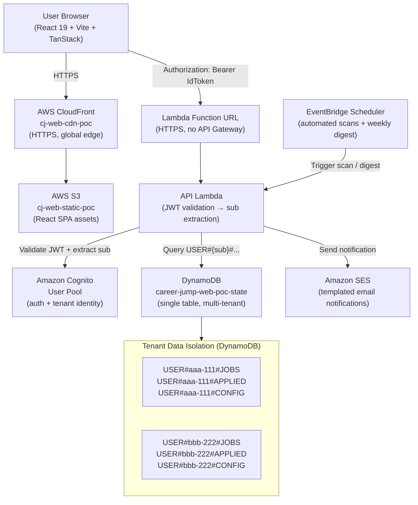
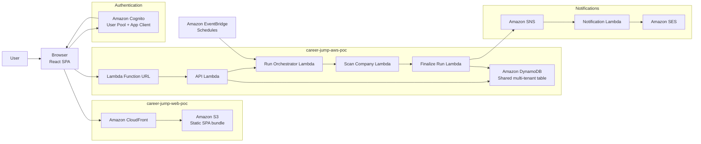
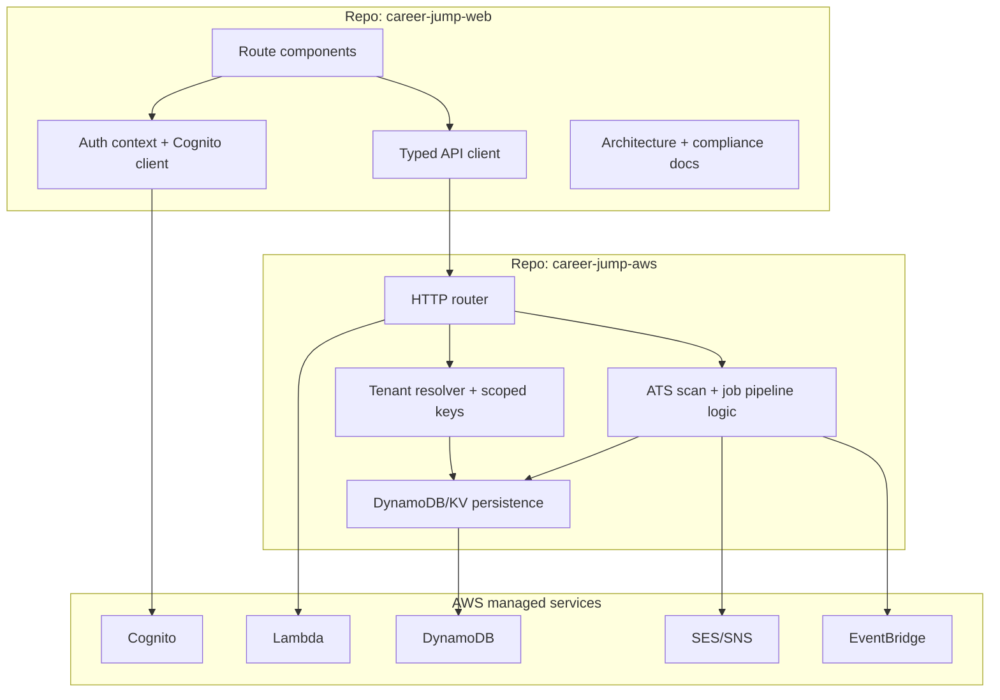
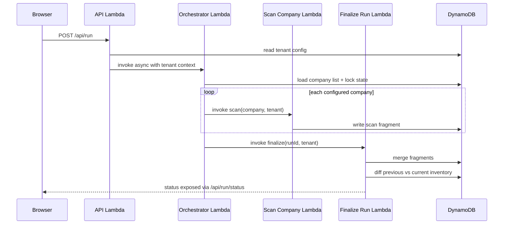
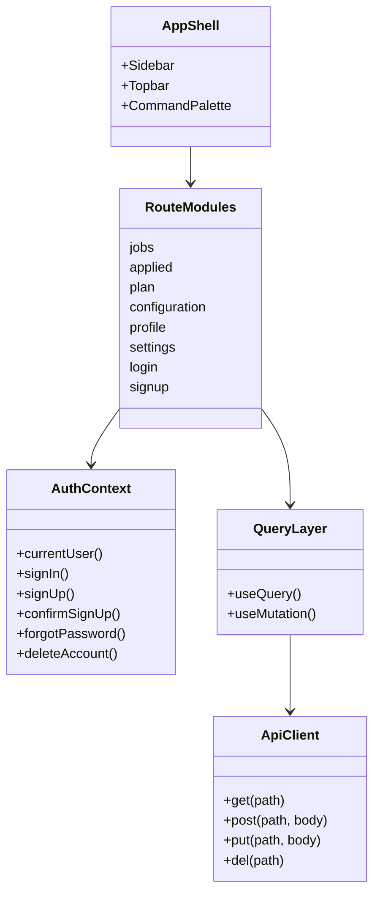
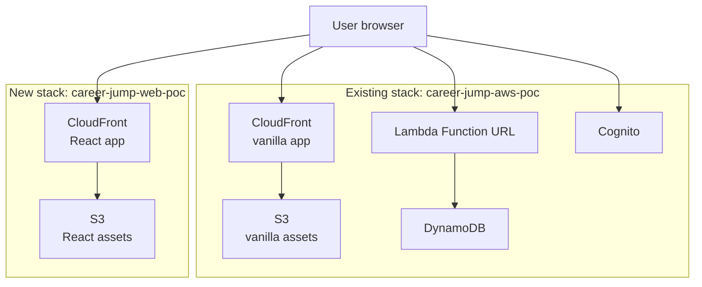

# System Architecture Overview

## Multi-Tenant SaaS Architecture

Career Jump has evolved from a single-user personal tool into a multi-tenant SaaS platform. Each user is a fully isolated tenant — their data is scoped to a unique partition key prefix in the shared DynamoDB table, derived from their Cognito `sub` claim. The system requires no infrastructure changes to onboard new tenants; isolation is enforced in application code at the Lambda layer.



## System Context Diagram

This diagram shows the official runtime boundaries: browser, isolated SPA hosting,
shared AWS backend, identity, email, and scheduler services.



## Runtime Containers

This UML-style container view shows how responsibilities are split across the
frontend repo, backend repo, and AWS-managed services.



**Key architectural properties:**
- Tenant identity is the Cognito `sub` UUID — immutable, JWT-verified, never client-supplied
- All DynamoDB operations are key-prefix scoped; cross-tenant access is architecturally impossible via the user-facing API
- Auth is Amazon Cognito (email + password, SRP protocol, OTP email verification)
- Email notifications flow through Amazon SES with user-controlled opt-in/opt-out preferences
- See `docs/architecture/multi-tenancy.md` for the full isolation model
- See `docs/architecture/auth.md` for the complete authentication and authorization design

---

## Product Summary

Career Jump is a personal job-monitoring tool that scans company career pages (via ATS APIs), filters postings by title/location/keywords, and manages a full application pipeline (Applied → Interview → Offer). Owned and operated by a single user (Dipak Bhujbal).

---

## Three Repositories

| Repo | Platform | Status | Touch? |
|------|----------|--------|--------|
| `career-jump` | Cloudflare Workers + KV + D1 | **Live production (MVP)** | Never — stable, in use |
| `career-jump-aws` | AWS Lambda + DynamoDB + S3/CloudFront + Cognito | **Active POC backend** | Yes — all backend work happens here |
| `career-jump-web` | React + Vite (this repo) | **UI rebuild, isolated AWS deploy live** | Yes — all frontend work happens here |

---

## Backend Architecture (`career-jump-aws`)

### Infrastructure (all in `us-east-1`, stack `career-jump-aws-poc`)

```
CloudFront (HTTPS)
  └── S3 bucket (static frontend assets — vanilla JS app today)
  
Cognito User Pool (PKCE auth, single allowed user)

Lambda Function URL (no API Gateway)
  └── API Lambda (30s, 512MB) — router, auth, all HTTP endpoints
        ├── Run Orchestrator Lambda (60s, 256MB) — fans out per-company scans
        │     └── Scan Company Lambda (180s, 256MB) × N companies (concurrent)
        │           └── Finalize Run Lambda (300s, 512MB) — merge, notify, release lock
        └── DynamoDB (single table: career-jump-web-poc-state)

EventBridge Scheduler — weekday scans every 3 hrs, 6am–9pm ET
```

### DynamoDB Table Design (single table)

| pk | sk | Contents |
|----|----|----------|
| `config#<userId>` | `config` | Runtime config: companies list, title filters |
| `inventory#<userId>` | `job#<jobId>` | Available job postings |
| `applied#<userId>` | `job#<jobId>` | Applied jobs + pipeline status |
| `run#<userId>` | `state` | Run lock, heartbeat |
| `fragment#<runId>` | `company#<companyId>` | Ephemeral scan fragments (merged then deleted) |
| `log#<runId>` | `<ts>#<company>` | Per-run logs (6-hr TTL) |
| `filter#<userId>` | `filter#<filterId>` | Saved search filters |

### Scan Run Flow

```
Browser → POST /api/run
  → API Lambda → invokes Orchestrator (async)
    → reads companies from DynamoDB
    → invokes Scan Lambda per company (concurrent)
      → fetches raw jobs from ATS provider
      → filters by title / geography / keywords
      → writes fragment to DynamoDB
    → last company triggers Finalize Lambda
      → merges fragments into inventory
      → diffs vs. previous inventory (new/updated jobs)
      → sends email notification (Google Apps Script webhook)
      → releases run lock
```

### Backend Execution Sequence



### Auth Flow

```
Browser → Cognito Hosted UI (PKCE)
  → login → ID token stored in localStorage
    → every request: Authorization: Bearer <id-token>
      → API Lambda validates token (aws-jwt-verify)
        → checks email == ALLOWED_USER_EMAIL env var
```

No API Gateway JWT authorizer — validation is in application code.

### ATS Adapters (`src/ats/`)

The backend has adapters for 16+ ATS providers:

| Category | Providers |
|----------|-----------|
| Core | Greenhouse, Ashby, Lever, SmartRecruiters, Workday |
| Additional | BambooHR, Breezy, Eightfold, Icims, Jobvite, Oracle, Phenom, Recruitee, SuccessFactors, Taleo, Workable |
| Custom | Apple (sitemap), Tesla, Berkshire, JSON-LD |

Each adapter normalizes raw postings into a common `JobPosting` schema. The registry (`src/ats/registry.ts`) auto-detects which adapter to use from a company's board URL.

---

## Frontend Architecture (`career-jump-web`)

### Tech Stack

| Layer | Choice |
|-------|--------|
| Framework | React 18 + TypeScript |
| Build | Vite |
| Routing | TanStack Router (file-based) |
| Data fetching | TanStack Query (React Query v5) |
| Styling | Tailwind CSS v4 (CSS variables for theming) |
| Drag & drop | @dnd-kit/core + @dnd-kit/sortable |
| Command palette | cmdk |
| Confetti | canvas-confetti |

### Pages / Routes

| Route | Feature |
|-------|---------|
| `/` | Dashboard — customizable widget grid |
| `/jobs` | Available jobs — table, filters, split-pane drawer |
| `/applied` | Applied jobs — kanban drag-and-drop pipeline |
| `/plan` | Action plan — interview rounds management |
| `/configuration` | Company config, scan settings, registry |

### Data Flow (Local Mock Mode)

```
React Component
  → TanStack Query (useQuery / useMutation)
    → api.get() / api.post()  [src/lib/api.ts]
      → fetch()
        → Mock Interceptor [src/mocks/install.ts]  ← active in ?demo=1
          → in-memory seed state [src/mocks/data.ts]
```

When connected to real backend:
```
      → fetch() → API Lambda Function URL
        → JWT token from localStorage
```

### Frontend Route and State Model



### Current Status

The app supports both local mock mode and live AWS integration:

- Local development can use the fetch mock from `src/mocks/install.ts`
- Production builds can point at the live Lambda Function URL and Cognito config
- The React frontend is deployed independently from the vanilla app on its own
  S3 + CloudFront stack

---

## Isolation Strategy (React Frontend Infra)

When deploying the React app to AWS, all new resources use isolated naming to avoid touching the vanilla app's infrastructure.

### Naming Conventions

| Resource | Name |
|----------|------|
| S3 bucket | `cj-web-static-poc-<accountId>` |
| CloudFront distribution | `cj-web-cdn-poc` |
| CloudFormation stack | `career-jump-web-poc` |
| Route53 record | `web.career-jump.app` (subdomain, when ready) |
| ACM certificate | `cj-web-poc-cert` |

### Tags on All New Resources

```
App=career-jump-web
Stack=react-rebuild
Environment=poc
Owner=dipak
```

### What Stays Shared (Backend)

The React app calls the **same `/api/*` endpoints** as the vanilla app. No backend duplication:
- Same Lambda, DynamoDB, Cognito, EventBridge
- Both apps see identical data → valid A/B comparison
- Flip DNS when ready to cut over

### Deployment Stack Separation

| Stack | Resources |
|-------|-----------|
| `career-jump-aws-poc` | All backend + vanilla frontend (existing, unchanged) |
| `career-jump-web-poc` | React S3 bucket + CloudFront only (new, isolated) |

## Deployment Topology Diagram


