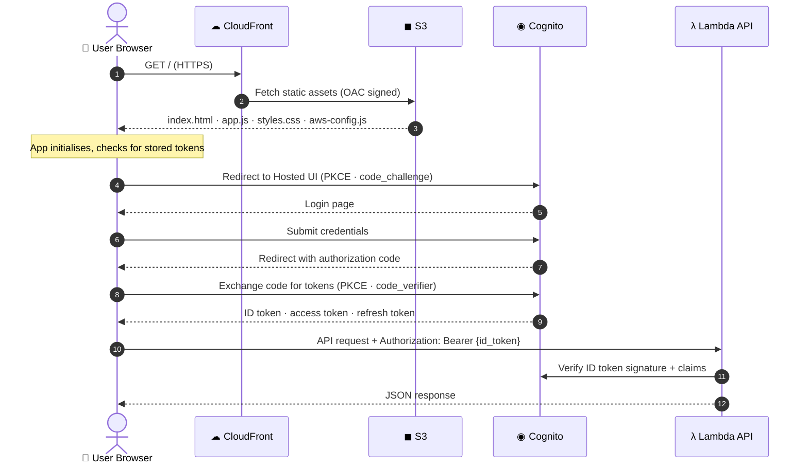
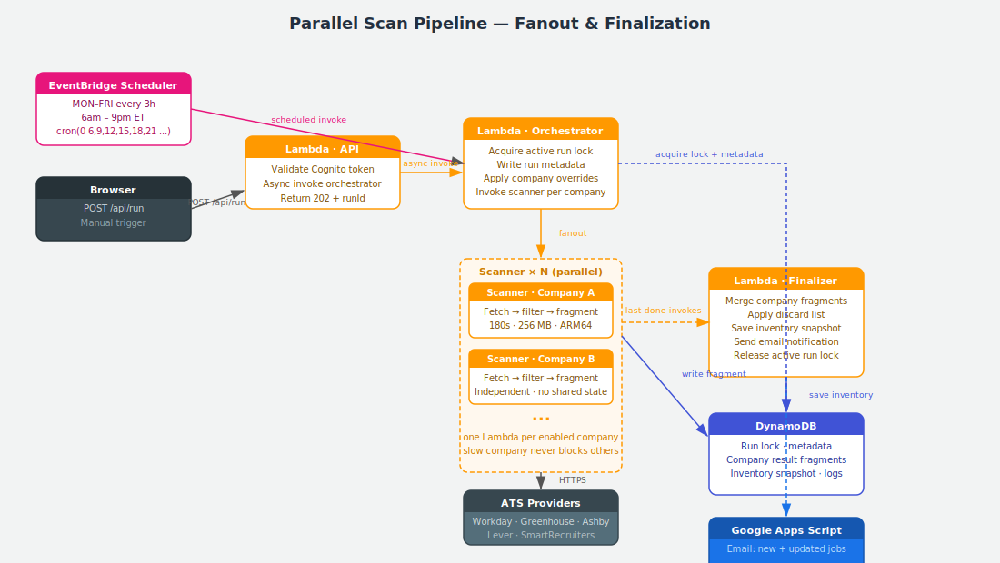
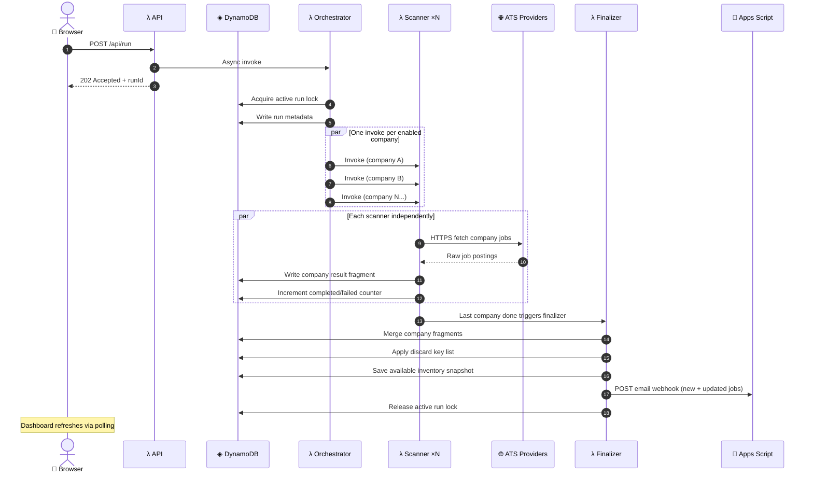
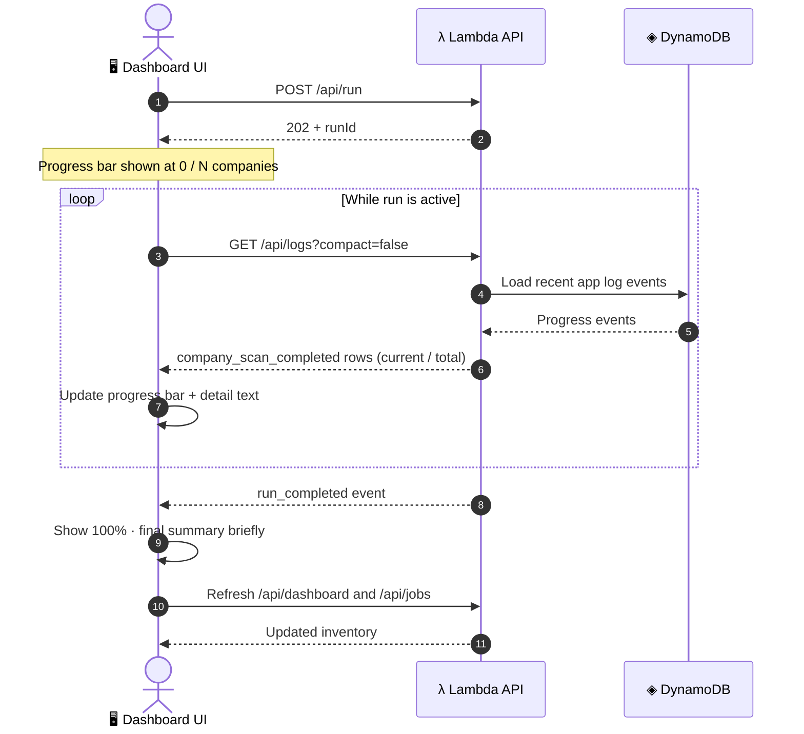
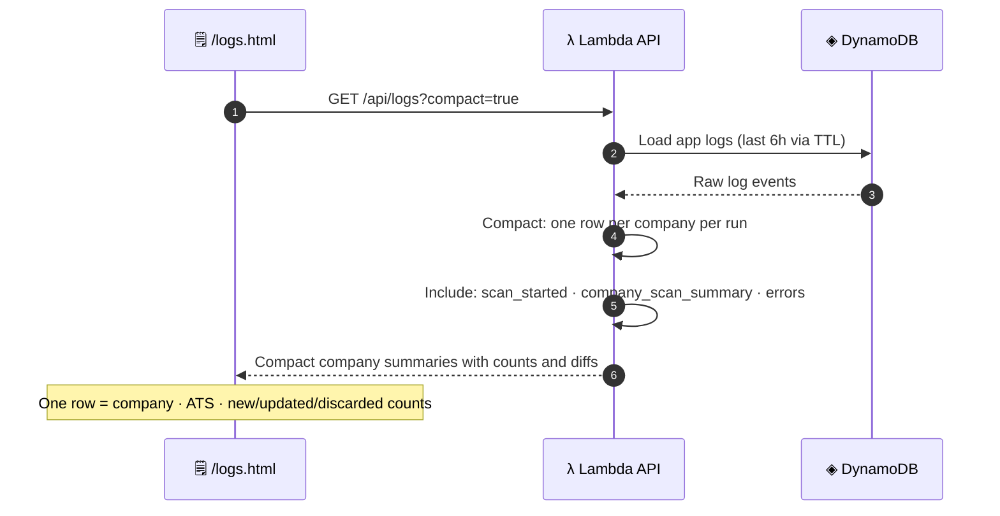
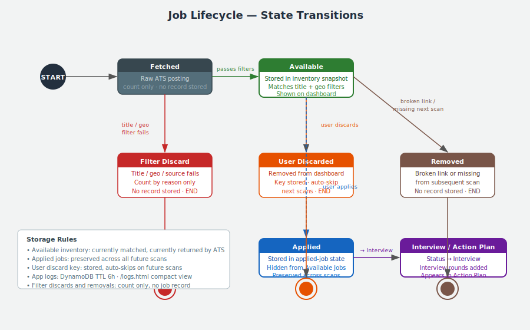

# API And Scan Flows

## High-Level API Surface

The browser is served by CloudFront/S3. API calls go directly to the Lambda Function URL carrying a Cognito ID token.

### Product Routes
| Route | Description |
| --- | --- |
| `/` | Main dashboard and job workflow |
| `/logs.html` | Compact operational logs |
| `/docs` | Swagger/OpenAPI documentation |

### API Routes
| Method | Route | Description |
| --- | --- | --- |
| `GET` | `/health` | Health check (public, no auth) |
| `GET` | `/api/dashboard` | Dashboard summary |
| `GET` | `/api/jobs` | Available jobs inventory |
| `GET` | `/api/applied-jobs` | Applied jobs list |
| `POST` | `/api/run` | Trigger a manual scan |
| `GET` | `/api/run/status` | Current run progress |
| `POST` | `/api/run/abort` | Abort active run |
| `GET` | `/api/config` | Runtime configuration |
| `POST` | `/api/config/save` | Save runtime configuration |
| `POST` | `/api/companies/:name/toggle` | Toggle company enabled state |
| `POST` | `/api/companies/toggle-all` | Toggle all companies |
| `POST` | `/api/jobs/status` | Update job status |
| `POST` | `/api/jobs/apply` | Move job to Applied |
| `POST` | `/api/jobs/notes` | Save job notes |
| `POST` | `/api/jobs/discard` | Discard job (stores footprint key) |
| `POST` | `/api/jobs/remove-broken-links` | Remove broken link jobs |
| `GET` | `/api/logs` | Application logs (compact or raw) |
| `GET` | `/api/openapi.json` | OpenAPI spec |

---

## Browser Auth Flow

---

## Parallel Scan Flow

### Sequence Detail

---

## Frontend Run Progress Flow

---

## Logs Flow

---

## Job Lifecycle

### State Transition Summary

| From | To | Trigger |
| --- | --- | --- |
| Fetched (raw) | Available | Passes title + geography + source filters |
| Fetched (raw) | Filter Discard | Title or geography filter fails |
| Available | Applied | User clicks Apply |
| Available | User Discarded | User clicks Discard — key stored, auto-skipped next scans |
| Available | Removed | Broken link or job missing from subsequent scan |
| Applied | Interview | User changes status to Interview |
| Interview | Action Plan | Interview round recorded |

### Storage Invariants

- `Available` jobs: stored only while currently matched and returned by the ATS.
- `Applied` jobs: preserved indefinitely across scans.
- `User Discarded` key: stored in `runtime:discarded_job_keys`; auto-skips on all future scans, dashboard, and email.
- `Filter Discards` and `Removals`: counted by reason only — no job record persisted.
- Notes: travel with the job from Available → Applied → Action Plan.
- App logs and decision summaries: DynamoDB TTL of 6 hours.

---

## Reliability Rules

| Rule | Mechanism |
| --- | --- |
| No overlapping inventory writes | One active run lock per tenant in DynamoDB |
| Slow company never blocks the run | Each Scanner Lambda is independent; fanout is parallel |
| Finalization is atomic | Finalizer runs only after all expected companies complete or fail |
| Progress always visible | Raw logs available via `compact=false` during 6h DynamoDB TTL |
| Paused companies preserved | Finalizer carries forward paused-company inventory untouched |
| Discard footprint persists | User discard keys survive scan cycles; auto-excluded from logs, dashboard, and email |
