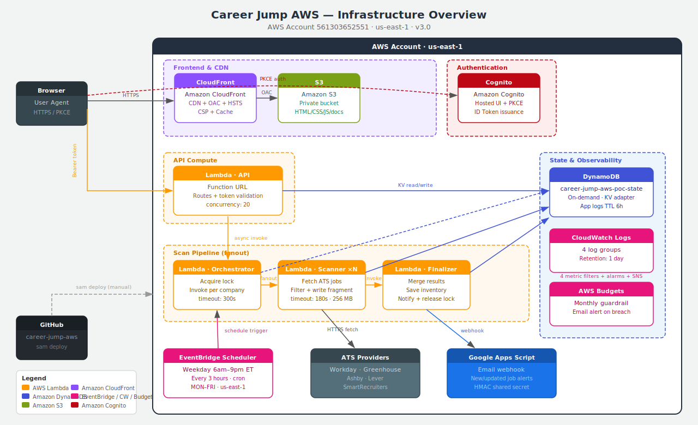
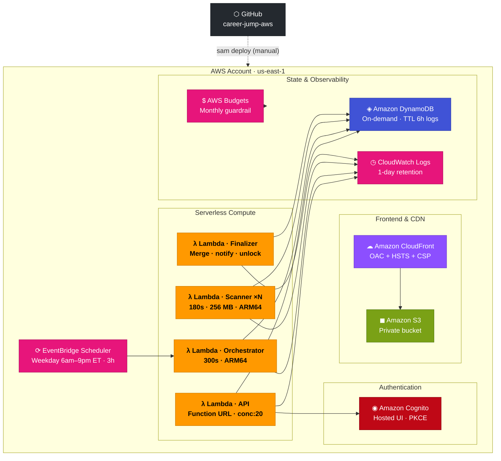

# Infrastructure

## System Overview

## Deployed AWS Services

| Service | CloudFormation Resource | Runtime Role |
| --- | --- | --- |
| **Amazon CloudFront** | `FrontendDistribution` | HTTPS entrypoint. OAC to private S3. HSTS, CSP, X-Frame-Options response headers. SPA fallback. Cache invalidation on deploy. |
| **Amazon S3** | `FrontendBucket` | Fully private. Static assets and generated `aws-config.js`. CloudFront OAC signs all requests. |
| **Amazon Cognito** | `UserPool`, `UserPoolClient`, `UserPoolDomain` | Hosted UI login. PKCE flow. ID token issuance. Single owner account only. |
| **AWS Lambda — API** | `ApiFunction` | Function URL. Cognito ID-token validation in app code. All routes. Concurrency: 20. |
| **AWS Lambda — Orchestrator** | `RunOrchestratorFunction` | Acquires active run lock. Writes run metadata. Invokes one scanner Lambda per enabled company. Timeout: 300s. |
| **AWS Lambda — Scanner** | `ScanCompanyFunction` | Fetches one company from its ATS. Filters by title and geography. Writes one company result fragment. Timeout: 180s · 256 MB · ARM64. |
| **AWS Lambda — Finalizer** | `FinalizeRunFunction` | Merges company fragments. Applies discard list. Saves inventory snapshot. Sends email notification. Releases run lock. |
| **Amazon DynamoDB** | `StateTable` | On-demand billing. KV-compatible adapter. Runtime config, inventory, applied jobs, discard keys, run locks, app logs (TTL 6h), decision summaries. |
| **Amazon EventBridge Scheduler** | `WeekdayEtScan` | `cron(0 6,9,12,15,18,21 ? * MON-FRI *)` · `America/New_York`. Weekday scans 6am–9pm ET every 3 hours. State: ENABLED. |
| **Amazon CloudWatch Logs** | 4 log groups | One-day retention. Metric filters and alarms on all 4 Lambda functions. SNS email on Lambda errors. |
| **AWS Budgets** | `MonthlyBudget` | Personal account cost guardrail. Email alert on breach. |
| **AWS CloudFormation / SAM** | `template.yaml` | Repeatable infrastructure definition. `sam deploy` from developer terminal. |

## Production Deployment Topology

## Security Boundary

- Static frontend assets are public through CloudFront; the S3 bucket is fully private with OAC.
- CloudFront enforces HSTS (63072000s), `X-Frame-Options: DENY`, CSP, and `X-Content-Type-Options`.
- Cognito is admin-created for the configured owner email only. No self-registration.
- Lambda Function URL uses `AuthType: NONE` to avoid API Gateway cost. Application code validates every non-health API request with a Cognito ID token.
- CORS is application-owned (`CORS_ALLOWED_ORIGIN` env var = CloudFront domain). Function URL and application headers do not duplicate.
- Apps Script webhook URL and shared secret are SAM parameter overrides — never committed.
- CloudWatch Logs retained one day. Application logs in DynamoDB with six-hour TTL.

## Cost Boundary

The POC intentionally avoids always-on or higher-floor services:

| Avoided | Reason |
| --- | --- |
| API Gateway | Lambda Function URL costs zero per-request overhead |
| NAT Gateway | No VPC needed for Lambda-to-ATS |
| RDS / EC2 / ALB / Fargate | Serverless-only footprint |
| OpenSearch / Step Functions | DynamoDB KV is sufficient |

Expected cost shape: Lambda requests, DynamoDB on-demand, S3 storage, CloudFront CDN requests, Cognito hosted login, one-day CloudWatch retention, AWS Budget.
