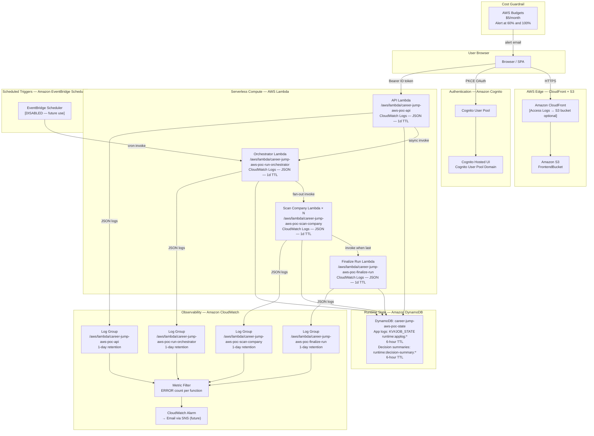
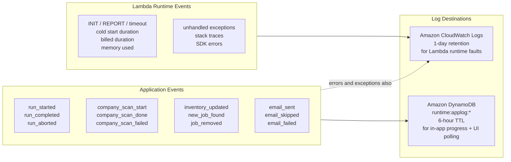
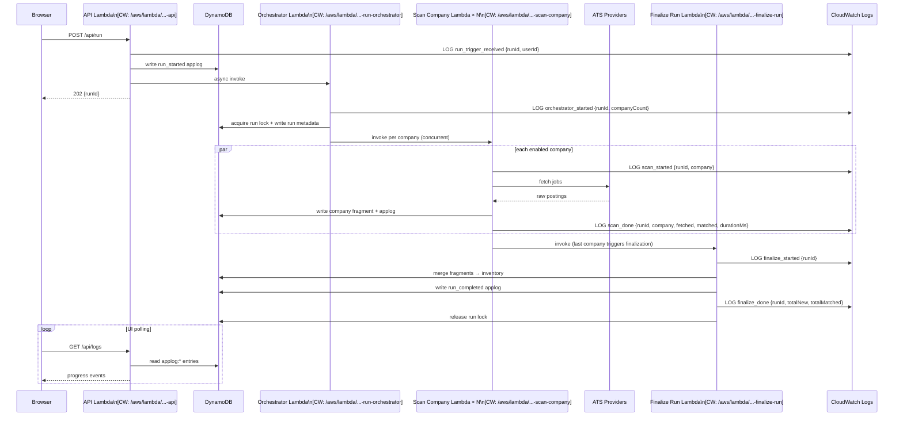
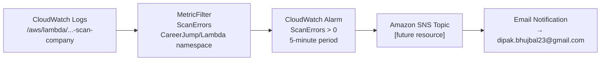
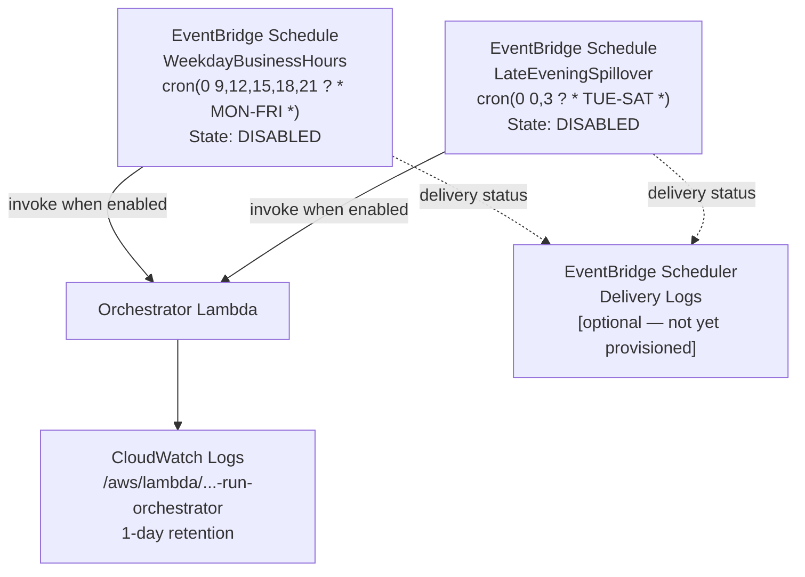
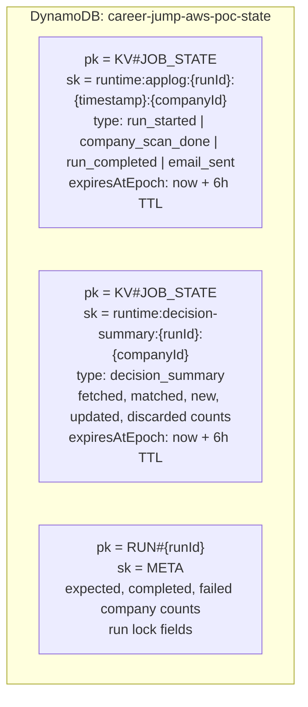

# Observability and Logging Architecture

Career Jump AWS POC — v2.2.x

All four Lambda functions emit structured JSON logs to dedicated Amazon CloudWatch Log Groups.
This document specifies the full observability layer: log groups, log schemas, metric filters,
alarm targets, and the two-tier logging model (CloudWatch for Lambda errors; DynamoDB for
application-level run logs).

---

## Full Observability Overview



---

## CloudWatch Log Groups

| Log Group | Lambda | Retention | Log Format |
|-----------|--------|-----------|------------|
| `/aws/lambda/career-jump-aws-poc-api` | API | 1 day | JSON |
| `/aws/lambda/career-jump-aws-poc-run-orchestrator` | Orchestrator | 1 day | JSON |
| `/aws/lambda/career-jump-aws-poc-scan-company` | Scan Company | 1 day | JSON |
| `/aws/lambda/career-jump-aws-poc-finalize-run` | Finalize Run | 1 day | JSON |

All log groups are defined explicitly in `template.yaml` so CloudFormation owns their lifecycle and retention policy.

---

## Two-Tier Logging Model



**Rule**: Lambda runtime telemetry (cold starts, timeouts, OOM, unhandled exceptions) lives in CloudWatch.
Application-level business events (scan progress, inventory diffs, job counts) live in DynamoDB with 6-hour TTL so the browser can poll them via `/api/logs`.

---

## Structured Log Schema

All Lambda functions use `LogFormat: JSON` (set in `template.yaml` `LoggingConfig`). The Lambda runtime wraps each `console.log` / `console.error` output as:

```json
{
  "timestamp": "2026-04-23T08:00:00.000Z",
  "level": "INFO",
  "requestId": "abc-123",
  "message": "...",
  "xRayTraceId": "Root=1-..."
}
```

Application-level log entries written to DynamoDB follow this shape:

```json
{
  "type": "company_scan_done",
  "runId": "run-2026-04-23T08:00:00.000Z",
  "company": "stripe",
  "fetched": 42,
  "matched": 8,
  "new": 2,
  "updated": 1,
  "discarded": 34,
  "durationMs": 4200,
  "timestamp": "2026-04-23T08:00:04.200Z"
}
```

---

## Scan Run Observability Flow



---

## CloudWatch Metric Filters (Recommended)

These metric filters can be added to `template.yaml` to surface error counts without a third-party APM tool.

| Filter Name | Log Group | Filter Pattern | Metric Namespace | Metric Name |
|-------------|-----------|----------------|-----------------|-------------|
| `ApiErrorCount` | `/aws/lambda/career-jump-aws-poc-api` | `{ $.level = "ERROR" }` | `CareerJump/Lambda` | `ApiErrors` |
| `OrchestratorErrorCount` | `/aws/lambda/career-jump-aws-poc-run-orchestrator` | `{ $.level = "ERROR" }` | `CareerJump/Lambda` | `OrchestratorErrors` |
| `ScanErrorCount` | `/aws/lambda/career-jump-aws-poc-scan-company` | `{ $.level = "ERROR" }` | `CareerJump/Lambda` | `ScanErrors` |
| `FinalizeErrorCount` | `/aws/lambda/career-jump-aws-poc-finalize-run` | `{ $.level = "ERROR" }` | `CareerJump/Lambda` | `FinalizeErrors` |

> Alarm threshold: any error count > 0 in a 5-minute window → SNS email (uses `BudgetEmail` parameter for low-cost single-subscriber setup).

---

## CloudWatch Alarm Flow (Future Addition)



> Not yet deployed — cost is negligible (SNS email is free-tier). Add when scheduled scans are enabled.

---

## EventBridge Scheduler + CloudWatch Integration



> EventBridge Scheduler delivery logs (failed invocations) can be directed to a separate log group when scheduled scans are activated.

---

## DynamoDB App Log Key Schema



---

## Implementation Checklist for @codex

> The following items are either already in place or are recommended additions. Items marked ✅ are shipped. Items marked 🔲 are architect-specified additions.

| # | Item | Status | File / Resource |
|---|------|--------|----------------|
| 1 | JSON log format on all four Lambdas | ✅ | `template.yaml` `LoggingConfig` |
| 2 | Explicit log group resources with 1-day retention | ✅ | `ApiLogGroup`, `RunOrchestratorLogGroup`, `ScanCompanyLogGroup`, `FinalizeRunLogGroup` in `template.yaml` |
| 3 | App-level run logs written to DynamoDB with 6h TTL | ✅ | `src/aws/` handlers, `src/lib/` |
| 4 | `/api/logs` route for browser polling | ✅ | `src/routes.ts` |
| 5 | CloudWatch Metric Filters for ERROR counts | 🔲 | Add `AWS::Logs::MetricFilter` resources to `template.yaml` |
| 6 | CloudWatch Alarm → SNS → email on scan errors | 🔲 | Add `AWS::CloudWatch::Alarm` + `AWS::SNS::Topic` to `template.yaml` |
| 7 | EventBridge Scheduler delivery log group | 🔲 | Add when schedules are enabled |
| 8 | Structured log helper in `src/lib/` | 🔲 | Add `logger.ts` with typed `log(level, event, payload)` helper that writes to both `console.log` (CloudWatch) and DynamoDB applog |
