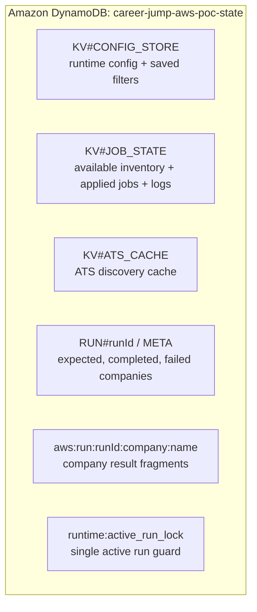
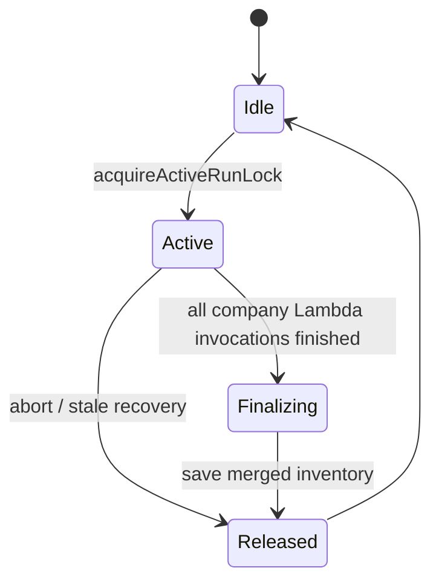

# Runtime State

## Active Runtime Storage Model

Career Jump AWS POC stores runtime data in a single DynamoDB table through a KV-compatible adapter.

## Key Families

| Key family | Purpose | Retention |
| --- | --- | --- |
| `KV#CONFIG_STORE` | company config, keyword rules, saved filters | durable until changed |
| `KV#CONFIG_STORE runtime:company_scan_overrides` | pause/resume overrides by company | durable until resumed or reset |
| `KV#JOB_STATE` inventory keys | latest available jobs, applied jobs, job notes, discard markers | durable until reset |
| `KV#JOB_STATE runtime:applog:*` | in-app operational logs | 6-hour TTL |
| `KV#JOB_STATE runtime:decision-summary:*` | per-company scan summaries with counts, updates, and discard reasons | 6-hour TTL |
| `KV#ATS_CACHE` | detected ATS mappings and convenience cache | cache TTL / explicit reset |
| `RUN#<runId>` | AWS fanout run counters | operational lifetime |
| `aws:run:<runId>:company:<name>` | per-company scan fragments | short TTL |

## Active Run Lock

The active run lock prevents overlapping final inventory writes.

Fields:

- `runId`
- `triggerType`
- `startedAt`
- `expiresAt`

## Logging Model

Raw application logs are retained so the progress bar can poll accurate run state. The logs page uses a compact view by default.

Compact `/logs.html` includes:

- run accepted / started
- one company scan summary row per company per run
- final `run_completed` inventory and notification outcome
- warnings and errors
- config and maintenance actions

Each company scan row includes fetched, matched, new, updated, excluded-title, excluded-geography, discarded, duplicate, suppressed-seen, duration, progress, and failure counts. Updated-job rows include previous/current field diffs.

Raw `/api/logs?compact=false` includes:

- per-company start / completion rows
- per-company inventory details
- new / updated job evaluation details
- email attempt rows

This keeps the operator view efficient while preserving detailed troubleshooting when needed.

## Source Of Truth

- Available jobs: latest inventory snapshot in DynamoDB filtered by applied-job state; it contains jobs that pass current filters and are still available.
- Applied jobs: applied-job state in DynamoDB; applying a job moves it out of the Available Jobs UI while preserving notes on the applied record.
- Action Plan: derived from applied-job interview rounds; no separate duplicate action-plan store is required.
- Job notes: stored as job attributes. Available-job notes live in `runtime:job_notes`; applying a role copies the note into applied-job state and clears the temporary available note.
- Configuration: runtime config in DynamoDB.
- Scan pause state: KV-backed company overrides keep configuration intact while excluding paused companies from scan planning.
- Run progress: run metadata plus raw application logs.
- Browser auth: Cognito ID token, validated by the API Lambda.

## Recycling Rules

- Fetched jobs that fail title/geography filters are discarded after count summarization.
- Jobs not returned by a later scan are removed from available inventory.
- Jobs from paused companies are preserved until those companies are reactivated and scanned.
- Broken links confirmed by cleanup are removed from available inventory.
- Discarded jobs and their notes are removed without creating `/logs` noise.
- Trend points with unchanged matched-count and keyword-count shape replace the latest point instead of extending history.
