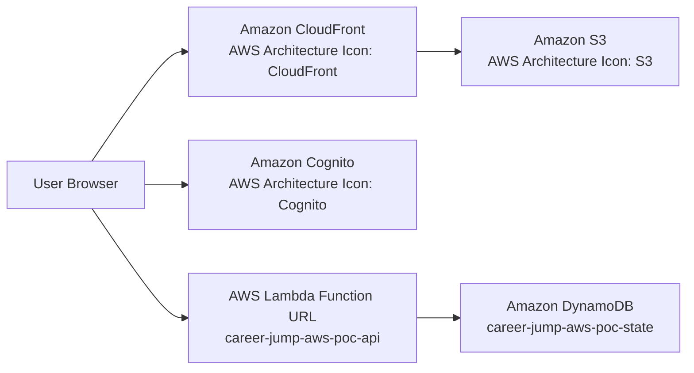
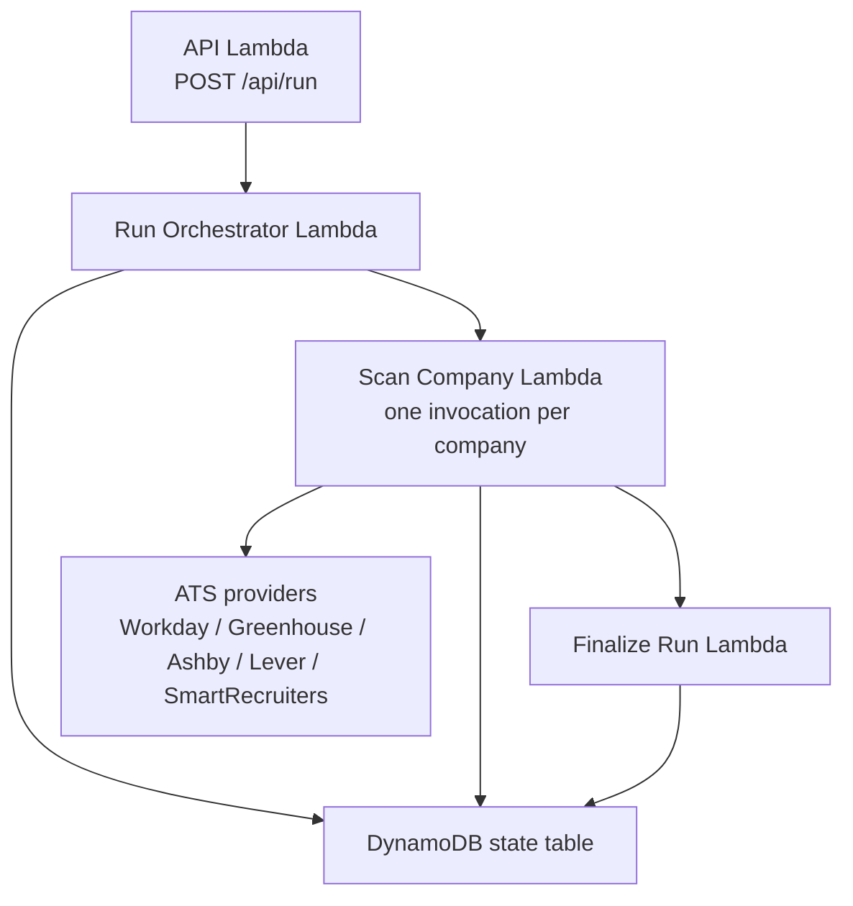

# Career Jump AWS POC

This repository is the GitHub-hosted AWS serverless runtime for Career Jump.

Current v2.2 scope:

- Keep the existing ATS fetchers and matching logic available for reuse.
- Use GitHub for source control and release branches. Production deploys are run manually from the developer terminal.
- Use AWS SAM, which deploys through CloudFormation, for repeatable low-cost infrastructure.
- Avoid AWS services that would push the POC above the low-cost target.

Initial cost guardrails:

- Prefer Lambda, DynamoDB, EventBridge Scheduler, S3, Cognito, and CloudFormation.
- Avoid API Gateway, Step Functions, Fargate, NAT Gateway, RDS, ALB, EC2, and OpenSearch during the first POC.
- Keep CloudWatch retention at 1 day and log only errors to CloudWatch.
- Store operational app logs in DynamoDB with six-hour TTL, not long-lived CloudWatch logs.
- Store only actionable job records: filtered available inventory plus applied jobs and their notes.
- Target AWS runtime cost: under 5 USD per month.

## Runtime Architecture

- `career-jump-aws-poc-api`
  - Lambda Function URL entrypoint for browser API calls.
  - No API Gateway.
  - Validates Cognito ID tokens in code and allows only the configured owner email.
  - Reserved concurrency is 20 to avoid transient browser refresh/run-polling 429s without creating idle cost.
- `career-jump-aws-poc-run-orchestrator`
  - Triggered by EventBridge schedules or `/api/run`.
  - Loads enabled companies and invokes one scan Lambda execution per company.
- `career-jump-aws-poc-scan-company`
  - Generic company scanner.
  - AWS runs all company invocations concurrently using Lambda concurrency.
  - Timeout is 8 minutes to give Workday enough room without returning to the old 15-minute monolith.
- `career-jump-aws-poc-finalize-run`
  - Runs once after all company scans finish.
  - Merges company results, preserves paused-company inventory, stores current actionable inventory, sends email notifications when configured, and releases the active run lock.

## AWS Service Map

| AWS architecture icon | Resource in this stack | Purpose |
| --- | --- | --- |
| Amazon CloudFront | `FrontendDistribution` | HTTPS entrypoint for the browser app. |
| Amazon S3 | `FrontendBucket` | Static app, logs page, docs page, and generated `aws-config.js`. |
| Amazon Cognito | `UserPool`, `UserPoolClient`, `UserPoolDomain` | Hosted login and ID-token issuance for the single owner. |
| AWS Lambda | API, orchestrator, scanner, finalizer functions | API handling and parallel company scan execution. |
| AWS Lambda Function URLs | `ApiFunctionUrl` | Direct HTTPS API endpoint with no API Gateway cost. |
| Amazon DynamoDB | `StateTable` | Runtime KV-compatible state, config, logs, run metadata, and company result fragments. |
| Amazon EventBridge Scheduler | Disabled schedules | Future scheduled scan triggers, intentionally disabled until secrets are configured. |
| Amazon CloudWatch Logs | Four one-day log groups | Error/runtime visibility with one-day retention. |
| AWS Budgets | Monthly budget | Cost guardrail for the personal AWS account. |
| AWS CloudFormation / SAM | `template.yaml` | Repeatable infrastructure definition. |

## Request And Run Flow





## Security Defaults

- Cognito user pool is admin-created only.
- Only `dipak.bhujbal23@gmail.com` is allowed by default.
- Lambda Function URL uses `AuthType: NONE`, but every non-health API request must include a valid Cognito ID token.
- CloudFront is kept in front of S3 because Cognito needs HTTPS redirects, S3 website hosting does not provide HTTPS directly, and CloudFront keeps the origin private with negligible single-user traffic cost.
- App secrets are SAM parameters / Lambda environment values and should not be committed.

## Deploy

Production deployment is run manually with `sam deploy` from the developer terminal. The stack name is `career-jump-aws-poc` and the default region is `us-east-1`.

## Release and Deploy

GitHub hosts the source code. Releases follow the branch model in [docs/release-runbook.md](./release-runbook.md).

The deploy command sequence (run by the developer from their terminal):

```bash
export AWS_DEFAULT_REGION=us-east-1
npm run check
sam validate --lint --region us-east-1
sam build
sam deploy --config-env poc --no-confirm-changeset
AWS_REGION=us-east-1 npm run aws:sync-frontend
```

See [docs/release-runbook.md](./release-runbook.md) for the full checklist, tagging steps, and post-deploy verification.

## Storage Optimization

- Fetched ATS jobs are not stored by default.
- Jobs are persisted only after they pass configured title/geography filters and are still available.
- Applying a job moves it out of the Available Jobs UI into applied-job state while preserving lifecycle notes.
- Changing status to `Interview` keeps the applied record and derives the Action Plan row from interview-round state.
- Jobs removed by broken-link cleanup or missing from a new active-company source scan are removed from available inventory.
- Paused-company inventory is retained until that company is active and scanned again.
- Manually discarded jobs are removed from available inventory and are not logged as `/logs` events.
- App logs and decision summaries expire after six hours through DynamoDB TTL.
- `/logs.html` shows one compact row per company per run, including all scan counts and updated-job previous/current diffs.
